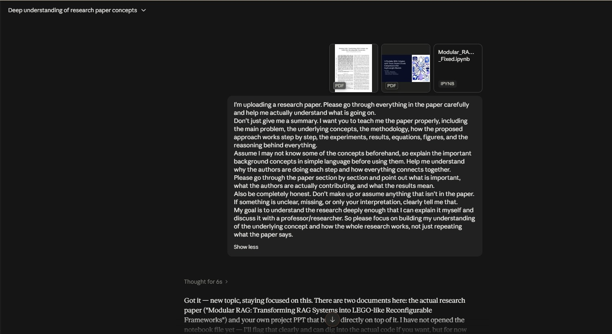

# AI Usage Guidelines

**Milestone:** 0  
**Issue Number:** #11  
**Date:** 09/09/2026

## Goal

Understand how to use AI tools responsibly and effectively while protecting data privacy and maintaining critical thinking.

## Research & Learn

### AI Tools I Use

I mainly use ChatGPT and Claude when working on coding tasks, understanding implementation approaches, debugging, researching unfamiliar concepts, and exploring different ways to solve a problem.

I sometimes use Google Gemini when I want to quickly understand basic terminology or concepts.

### Benefits of Using AI

AI can help with:
- Understanding unfamiliar or complicated concepts.
- Exploring different approaches to a problem.
- Debugging and reviewing code.
- Explaining technical topics in simpler language.
- Speeding up research and learning.

### Risks of Using AI

Some risks include:
- Incorrect or outdated information.
- AI making assumptions that are not supported by the source.
- Becoming too dependent on AI instead of developing my own understanding.
- Accidentally sharing confidential or sensitive information.
- Accepting generated code or explanations without checking them.

### Information I Should Not Enter Into AI Tools

I should not enter confidential company information, private user data, credentials, passwords, API keys, tokens, personal information, or other sensitive internal information into AI tools unless the use is explicitly authorised and the tool is approved for that type of information.

### Fact-Checking AI Output

I should treat AI output as assistance rather than automatically correct information. For technical or research-related work, I can:
- Check the original documentation, paper, or other reliable source.
- Compare important claims with the source material.
- Test generated code where applicable.
- Check assumptions and edge cases.
- Use my own understanding to decide whether the output actually makes sense.

## Reflection

### When Should I Use AI?

I can use AI when I need help understanding a difficult concept, exploring possible approaches, debugging, researching, or getting another perspective on a problem.

I should rely on my own skills when making important decisions, evaluating whether an approach is actually suitable, and verifying the correctness of the final result.

### Avoiding Over-Reliance

I want to use AI as a learning and productivity tool rather than a replacement for understanding. I should try to understand the problem first, ask AI for explanations or possible approaches when useful, and then verify and adapt the result myself.

For coding in particular, I should understand the generated code before using it and test it against the actual requirements.

### Data Privacy

Before using an AI tool, I should check what information I am providing. I will avoid entering confidential or sensitive Focus Bear information, user data, credentials, or other private information unless the use is explicitly permitted.

## Task

### Using AI to Understand a Research Paper

I used AI while working on an academic research project to help me understand a research paper in greater depth.

Instead of asking for only a summary, I asked the AI to explain the paper section by section, including the main problem, underlying concepts, methodology, experiments, results, figures, and the reasoning behind the proposed approach.

This was useful because some of the concepts in the paper were unfamiliar to me. I used the AI to build enough background understanding to follow what the researchers were doing and how the different parts of the paper connected. The AI was useful for explaining complicated ideas in simpler language, but I still needed to read and understand the original paper myself.

## Best Practice

**I will use AI to assist my work and learning, but I will remain responsible for understanding and verifying the final result.**

I will avoid putting confidential or sensitive information into AI tools, verify important technical information against reliable sources, and make sure I understand any AI-generated code or suggestions before using them.
