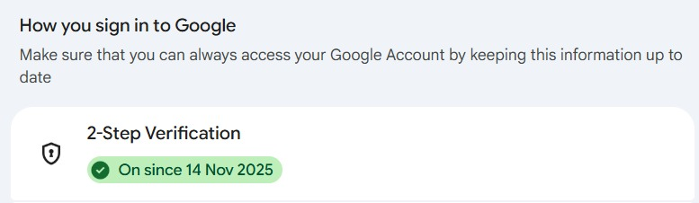
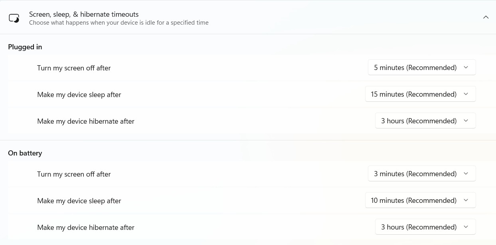
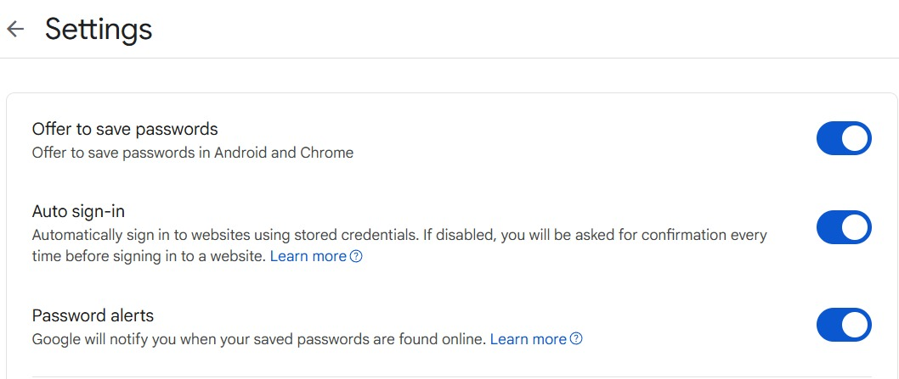
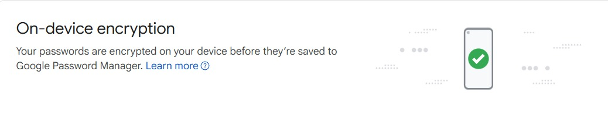

# Cyber Security Guidelines

**Milestone:** 0   
**Issue Number:** #10   
**Date:** 10/09/2026

## Goal

Understand and follow basic cyber security practices to protect company, user, and personal information.

## Research & Learn

### Common Cyber Security Threats

Some common threats in remote work include:
- Phishing emails and suspicious links.
- Weak or reused passwords.
- Malware and malicious downloads.
- Unsecured devices or networks.
- Accidental sharing of confidential information.
- Stolen or compromised accounts.

### Keeping Devices and Accounts Secure

Good security practices include:
- Using strong and unique passwords.
- Using a password manager.
- Enabling 2FA wherever possible.
- Keeping devices and software updated.
- Locking devices when away.
- Avoiding suspicious links and downloads.

### Why Locking the Computer Matters

A computer should be locked when I am away because someone with physical access to an unlocked device could access accounts, files, or other sensitive information.

### Phishing and Suspicious Links

If I receive a suspicious message, I should:
- Check the sender and message carefully.
- Avoid clicking unexpected links or attachments.
- Never enter credentials through an untrusted link.
- Verify unusual requests through a trusted channel.
- Report suspicious activity when appropriate.

### Strong Passwords and Password Managers

Strong passwords should be difficult to guess and preferably unique for each important account.

A password manager helps store and manage passwords securely and makes it easier to use different passwords instead of reusing the same one.

### Importance of 2FA

2FA provides an additional layer of protection even if a password is compromised. I should enable it on important accounts whenever it is available.

## Reflection

### Security Measures I Currently Follow

- I use Google 2-Step Verification on my Google account.
- I use Google Password Manager to store and manage saved passwords.
- Password saving and password alerts are enabled.
- Google Password Manager uses on-device encryption for saved passwords.
- I have configured screen and sleep timeouts on my laptop.

### Where I Can Improve

I reviewed my saved passwords using Google Password Manager's Password Checkup and found that some passwords are weak or reused, including one compromised password.

I will prioritise changing the compromised password and gradually replace reused or weak passwords with stronger and unique ones.

### Making Secure Behaviour a Habit

I can make security a habit by:
- Checking account security regularly.
- Using 2FA whenever possible.
- Avoiding password reuse.
- Locking my devices when I step away.
- Thinking carefully before clicking unexpected links.
- Reporting suspicious activity instead of ignoring it.

### Password and Account Security

I will use a password manager to manage my passwords and avoid reusing important passwords. I will also keep 2FA enabled on important accounts and review security alerts when they appear.

### If I Suspect a Security Breach

If I notice suspicious activity or believe an account has been compromised, I would:
- Stop interacting with anything suspicious.
- Secure the affected account and change the password.
- Review active sessions and security settings.
- Enable or verify 2FA.
- Preserve relevant information about the incident.
- Report the issue through the appropriate Focus Bear channel.

## New Cyber Security Habit

My new habit will be to verify unexpected links and requests before interacting with them, especially if they ask for credentials, personal information, or access to an account. I will also check the sender and context and use a trusted channel to verify unusual requests when necessary.

## What I Learned

Cyber security is not only about technical tools. Small habits such as using unique passwords, enabling 2FA, locking devices, checking suspicious messages, and protecting sensitive information can significantly reduce security risks.