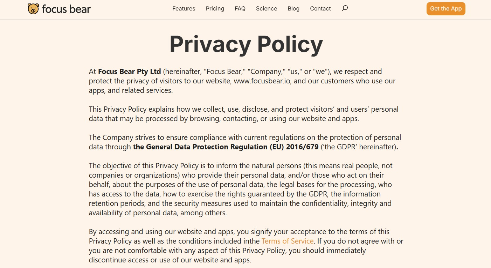
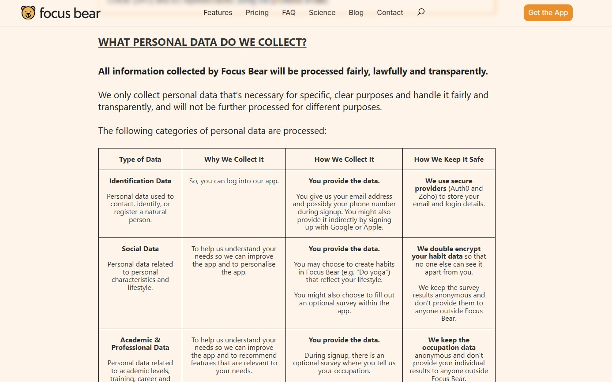

# Data Privacy & Confidentiality

**Milestone:** 0  
**Issue Number:** #15  
**Date:** 04/09/2026

## Goal

Understand how to handle sensitive data responsibly and follow Focus Bear's privacy and confidentiality practices.

## Reflection

### Key Learnings

Focus Bear collects different types of personal data, including identification, lifestyle and habit, academic and professional, technical, financial, profile, and aggregate data. Some sensitive information, such as health-related information, may also be collected in certain circumstances.

The policy states that personal data should be collected and processed fairly, lawfully, and transparently, and only for specific purposes.

### Secure Data Handling

In my daily work, I will avoid sharing confidential information unnecessarily and use only approved systems and services to store or share work-related data.

- **Store:** Keep sensitive information only in authorised and secure locations, with access limited to people who need it.
- **Share:** Check the recipient and permissions before sharing sensitive information and use secure, approved communication or file-sharing methods.
- **Dispose:** Remove sensitive information when it is no longer required according to the organisation's retention requirements. Paper records should be securely destroyed, while electronic data should be securely deleted or sanitised rather than simply discarded.

I will avoid sharing confidential information unnecessarily, use only approved systems and services to store or share work-related data, and make sure sensitive information is not exposed through screenshots, messages, repositories, or public links.

I will also check recipients and permissions before sharing information and avoid storing confidential data in personal or public locations.

### Suspected Data Breach

If I notice a suspected data breach or accidental disclosure, I would avoid further sharing the information, preserve the relevant details or evidence, and report the incident to the appropriate Focus Bear team member immediately so it can be investigated and handled properly.

The Privacy Policy specifically includes security breach management as one of the purposes for processing personal data and states that Focus Bear has technical and organisational measures to protect personal data. 

### Common Mistakes and Prevention

Common mistakes include sharing sensitive information with the wrong person, using public repositories or links for confidential information, leaving sensitive information visible in screenshots, and storing work data in unauthorised locations.

I can reduce these risks by checking permissions and recipients before sharing, keeping confidential information out of public repositories, and using approved tools and storage locations.

### Security Practice I Will Adopt

A key practice I will adopt is to **check the sensitivity of information and its intended recipient before sharing or storing it**. I will also avoid putting confidential or user information into screenshots, public GitHub repositories, or other places where it could be unnecessarily exposed.

## What I Learned

The main takeaway from this task is that protecting user data is not only about passwords or technical security. It also involves limiting access, using data only for appropriate purposes, being careful about third-party services, and reporting potential security incidents responsibly.
