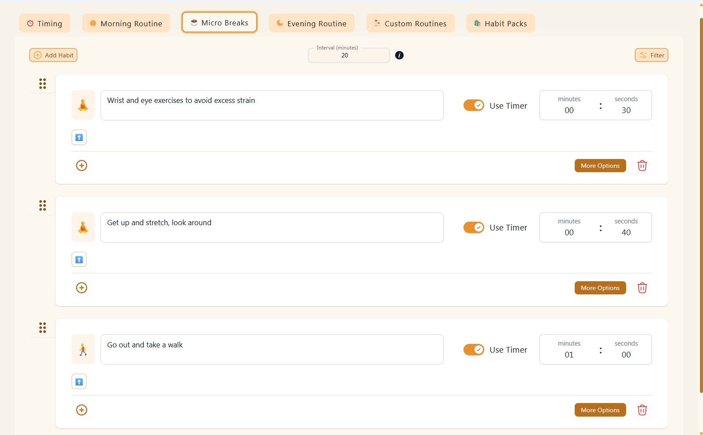

# Occupational Health & Safety (OHS) for Desk-Based Work

**Milestone:** 0  
**Issue Number:** #16  
**Date:** 04/09/2026

## Goal

Understand how to maintain a safe and ergonomic workspace while working on a laptop and develop habits that reduce strain and discomfort.

## Reflection

### Workspace and Equipment

Long periods of laptop use can cause poor posture and neck, shoulder, and wrist strain. A laptop stand, external keyboard, and mouse can help improve posture and comfort.

I adjusted my laptop setup by raising the screen to a more comfortable viewing height so that I do not have to continuously look down while working.

### Behavioural Changes

Avoid sitting in the same position for too long, avoid straining eyes too much and take regular movement breaks.

### Focus Bear Micro Breaks

I explored the **Micro Breaks** feature in Focus Bear through **Settings → Micro Breaks → Edit Habit**.

The feature allows a break interval to be set to determine how frequently reminders appear. A habit can also be assigned to each break. I set my habits to include **"Get up and stretch, look around"** and **"Go out and take a walk."**

The duration of the habit is optional, so a specific amount of time can be assigned to an activity, or the feature can simply provide a reminder to take a break. Different habits can also have different durations.

I also noticed that Focus Bear validates the duration entered and displays an error when an invalid duration is provided.

A micro break can be **postponed** when necessary or started immediately. Before starting the break, Focus Bear provides a space to capture your thoughts, which helps you remember what you were working on and reduces the concern of losing your train of thought.

I found these features useful because they make it easier to take regular breaks while keeping track of what I was doing. I plan to use the reminders during longer work sessions to make movement breaks a regular habit.
