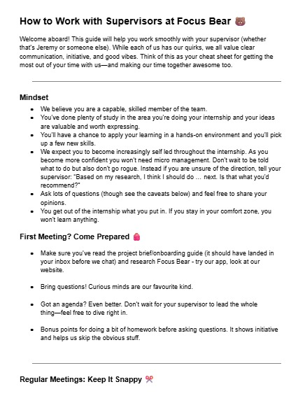

# Professionalism at Focus Bear

**Milestone:** 0  
**Issue Number:** #14    
**Date:** 04/09/2026

## Goal

Understand the professional expectations at Focus Bear and how to communicate effectively while maintaining a positive, respectful, and inclusive work environment.

## Reflection

### Professional vs. Unprofessional Behaviour

Professionalism at Focus Bear does not mean being overly formal. It means being respectful, responsible, and accountable while still being able to have fun and be yourself.

Professional behaviour includes:

- Communicating clearly and respectfully.
- Being prepared for meetings and knowing what I have been working on.
- Taking notes and following up on action items.
- Giving regular updates instead of waiting to be asked.
- Taking initiative while asking for guidance when I am unsure.
- Listening to feedback and using it to improve.

Unprofessional behaviour would include:

- Ignoring messages or important action items.
- Coming to meetings unprepared.
- Not taking notes and repeatedly asking the same questions.
- Waiting for instructions when I could make reasonable progress independently.
- Ignoring feedback or repeatedly making the same mistakes.
- Communicating disrespectfully or creating a hostile environment.

### Teamwork and Professionalism

I have seen that good teamwork works best when everyone communicates clearly, listens to each other, and follows through on their responsibilities. People knowing what others are working on and being willing to help when someone is blocked makes teamwork more effective.

During my internship, I can contribute by being approachable, respectful, reliable, and willing to help others. I can also help create a positive environment by being friendly and having fun while still taking my responsibilities seriously.

### Respectful Communication

Since much of the communication is remote, written messages need to be clear because tone can sometimes be misunderstood.

I will:

- Keep messages polite, clear, and concise.
- Explain the context when asking for help.
- Avoid making assumptions during disagreements.
- Ask for clarification instead of reacting defensively.
- Give people enough information to understand what I need.
- Use the appropriate communication method depending on urgency.

In the guide provided, using the lightest touch depending on the urgency is encouraged:

- **Email:** General communication, with an expected response within 48 hours.
- **Discord/Teams:** Medium-priority communication, where a response is needed within 24 hours.
- **SMS:** Urgent matters requiring a response within around 2 hours.
- **Call:** True emergencies.

### Giving and Receiving Feedback

When giving feedback, I should focus on the action or situation rather than making it personal. I should explain what could be improved and communicate it respectfully.

When receiving feedback, I should:

- Listen carefully instead of becoming defensive.
- Ask questions if I do not understand the feedback.
- Take notes when appropriate.
- Apply the feedback to my work.
- Avoid repeating the same mistake without trying to improve.

I think feedback is most useful when I treat it as an opportunity to improve rather than as criticism.

### Preparing for Meetings

Before a meeting with my supervisor or colleagues, I should:

- Read the relevant project brief or documentation.
- Review what I have completed since the previous meeting.
- Note down questions and blockers.
- Prepare an agenda when appropriate.
- Have relevant work or results ready to discuss.
- Take notes during the meeting.
- Record action items and follow up afterwards.
- Avoid multitasking during the meeting.

The supervisor guide emphasises being prepared, asking questions, taking notes, avoiding multitasking, and following up on action items.

### Following Up and Escalating

If I need information or an action from someone, I should first use the appropriate communication method and give them reasonable time to respond.

If I do not receive a response, I can send a polite follow-up rather than assuming that the person has ignored my message.

If the matter becomes more urgent, I should escalate using a more immediate communication method instead of repeatedly waiting on email. I would escalate when the lack of a response is blocking important work, a deadline is approaching, or the issue is genuinely urgent.

### Things I Will Not Do

During my internship, I will avoid:

- Ghosting my project or failing to provide updates.
- Ignoring feedback or action items.
- Coming to meetings unprepared.
- Multitasking during meetings.
- Repeatedly asking questions without first attempting basic research.
- Waiting around for instructions when I can make reasonable progress independently.
- Being disrespectful, discriminatory, or dismissive towards teammates.
- Sharing disagreements in a hostile or personal way.
- Ignoring an issue that needs to be escalated.

## What I Learned

The main thing I learned is that professionalism at Focus Bear is about being responsible and respectful rather than being overly formal. I can still be myself and enjoy the work while communicating clearly, taking ownership of my tasks, listening to feedback, and keeping my teammates informed.

I also learned that being proactive does not mean going completely on my own. It means making a reasonable attempt, communicating my thinking, and asking for guidance when I genuinely need it.