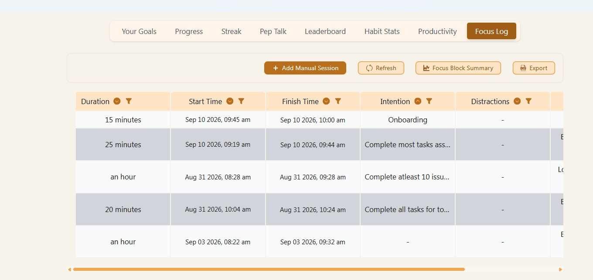
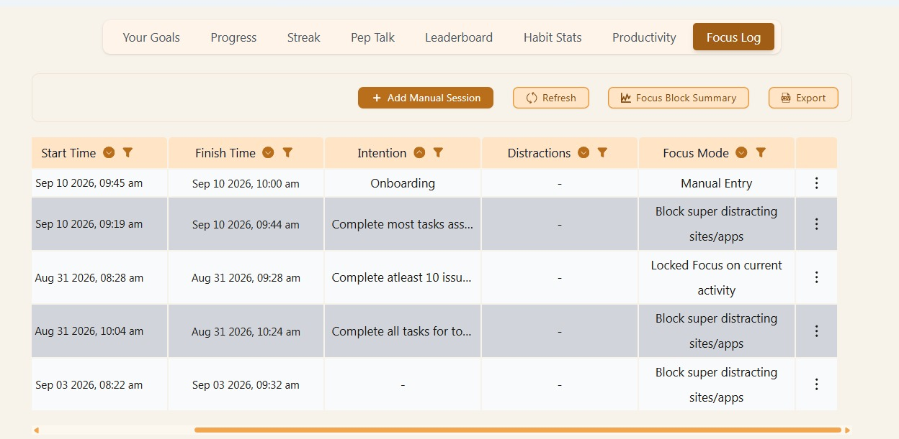

# Internship Time Plan

**Internship:** Backend Developer Intern     
**Total Hours:** 80 hours  
**Planned Hours:** 10–15 hours per week  
**Work Location:** Remote / Work from Home

## Goal

My goal is to complete the internship requirements while giving enough time to properly learn, understand the assigned work, and contribute effectively. I plan to manage my internship hours alongside my university commitments.

## Weekly Schedule

| Day | Planned Time | Hours |
|---|---|---:|
| Monday | 8:30 AM – 11:30 AM | 3 |
| Tuesday | 8:30 AM – 11:30 AM | 3 |
| Wednesday | 8:30 AM – 11:30 AM | 3 |
| Thursday | 8:30 AM – 11:30 AM | 3 |
| Friday | 8:30 AM – 11:30 AM | 3 |
| **Total** | | **15 hours/week** |

The schedule is flexible depending on my other commitments. I may work additional hours when required while keeping the internship workload within the planned range.

## Focus Bear Time Tracking

I use Focus Bear to record my internship work sessions. This helps me track the time spent on internship tasks and maintain a record of my work while also focus when completing the onboarding tasks without any distractions.

