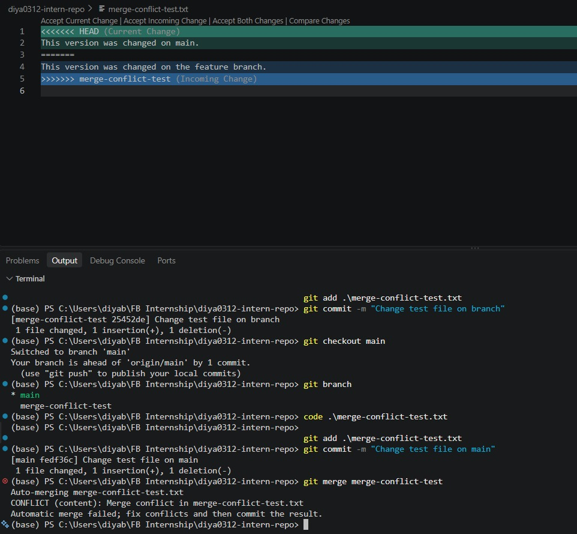
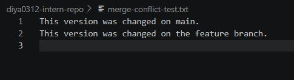

# Merge Conflicts & Conflict Resolution

**Milestone:** 1  
**Issue Number:** #59  
**Date:** 10/09/2026

## Goal

Understand why merge conflicts happen and how to resolve them using Git.

## What Caused the Conflict?

- I made a change to `merge-conflict-test.txt` on the `merge-conflict-test` branch.
- I then made a different change to the same part of the file on the `main` branch.
- When I tried to merge the branches, Git could not automatically decide which change to keep.
- This resulted in a merge conflict.

## How Did I Resolve It?

- I opened the conflicted file and reviewed the changes from both branches.
- Git showed conflict markers indicating the two different versions.
- I used the GitHub Desktop conflict resolution workflow with VS Code to resolve the conflicting changes.
- I selected the version I wanted to keep and removed the conflict markers.
- I then staged the resolved file and committed the merge.

## What Did I Learn?

- Merge conflicts are a normal part of working with multiple branches.
- A conflict occurs when Git cannot automatically combine changes.
- It is important to review both versions before deciding what to keep.
- Conflict markers make it clear which changes came from each branch.
- After resolving a conflict, the file needs to be staged and the merge needs to be committed.