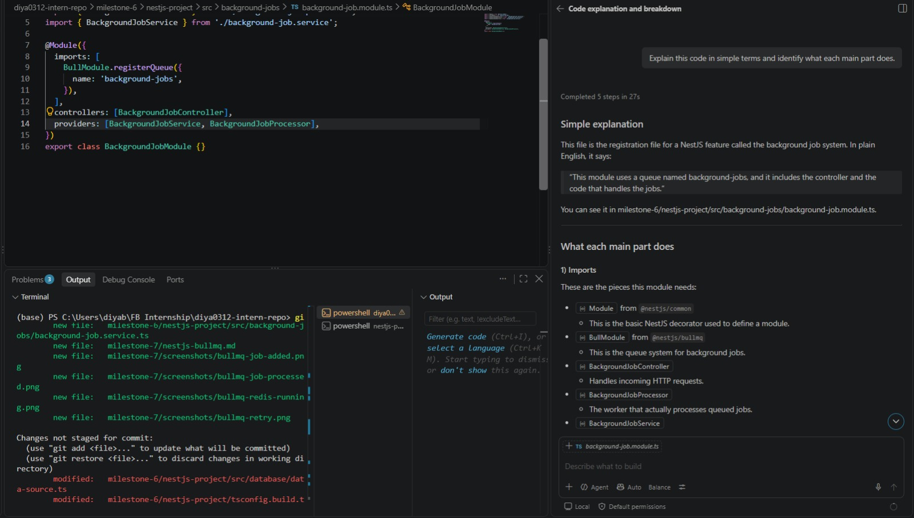

# AI Tools for Development

**Milestone:** 2      
**Issue Number:** #52      
**Date:** 04/10/2026

## AI Tools Tried

I explored two AI tools for development:

- GitHub Copilot
- ChatGPT

GitHub Copilot was used directly in Visual Studio Code for coding assistance and debugging. ChatGPT was used for coding questions, explanations, and understanding development concepts.

## GitHub Copilot

GitHub Copilot provides AI-powered coding suggestions inside the development environment. I used Copilot Chat to ask questions about code and generate simple code examples.

I experimented with prompts for:

- Generating a simple code snippet
- Explaining existing code
- Identifying and fixing a simple coding problem

## What Worked Well

- AI tools can provide quick explanations of unfamiliar code.
- They can generate basic code snippets quickly.
- They are useful for finding possible causes of simple errors.
- They can help understand programming concepts through examples.
- Copilot is convenient because it works directly inside VS Code.

## What Did Not Work Well

- AI-generated code may not always match the exact requirements of a project.
- Generated code still needs to be reviewed and tested.
- AI can sometimes provide solutions that are more complicated than necessary.
- Developers should not blindly copy AI-generated code without understanding it.

## When AI Is Most Useful for Coding

I think AI is most useful when:

- Learning a new programming concept
- Understanding unfamiliar code
- Debugging simple errors
- Generating small code snippets
- Creating test cases
- Exploring different approaches to a programming problem

AI should be treated as a development assistant rather than a replacement for understanding the code.

## Overall Experience

Using AI tools made development faster, especially for learning, debugging, and exploring possible solutions. However, I found that the generated output still needs to be checked for correctness, security, and compatibility with the existing project.

The most useful approach is to use AI to support development while still understanding and testing the final code.