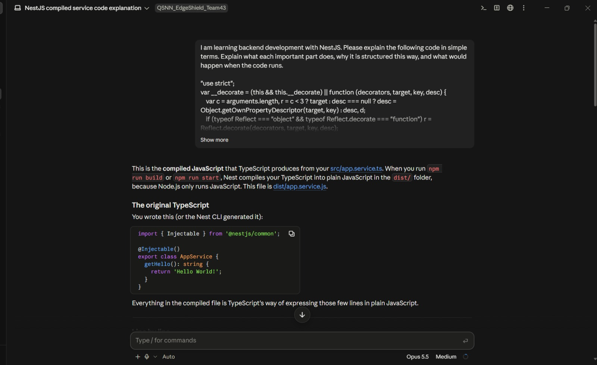
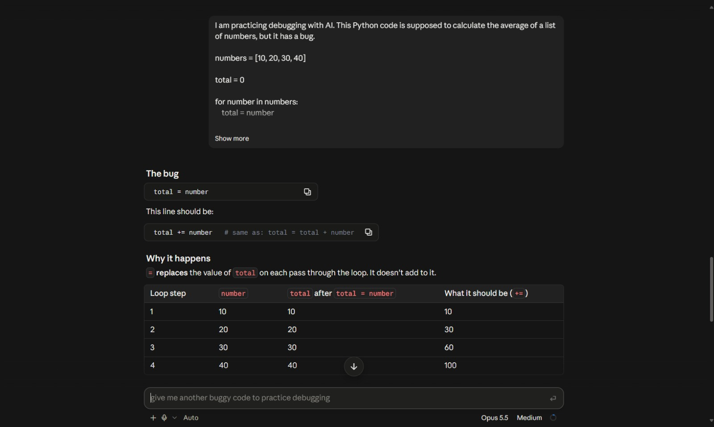

# Learning AI Coding Tools  

**Milestone:** 2        
**Issue Number:** #51        
**Date:** 04/10/2026  

## Tool Used

I used **Claude Code** as an AI-assisted development tool.

I used it to support my development learning. I reviewed the suggestions and used them to understand the reasoning behind the solutions.

## Task 1: Understanding Existing Code

I used Claude to explain an existing piece of backend code.

I asked Claude to:

- Explain what the code does.
- Explain the important parts of the code.
- Explain why the code is structured that way.
- Describe what happens when the code runs.

Claude was useful for breaking the code into smaller parts and explaining the purpose of each component in simpler terms.

## Task 2: Debugging

I also used Claude to debug a small Python program that was calculating the average of a list of numbers.

The program contained a logical error where the running total was overwritten instead of being increased for each number.

Claude identified the problem, explained why it occurred, and suggested changing the assignment to an addition assignment.

This helped me understand not only the corrected code but also how to identify the logical error.

## What Claude Helped With

Claude was useful for:

- Understanding unfamiliar code.
- Breaking complex code into simpler explanations.
- Identifying logical errors.
- Suggesting possible fixes.
- Explaining why a particular solution works.
- Supporting the learning process while working with code.

## What Claude Struggled With

AI-generated answers still need to be reviewed carefully.

Claude may provide a technically valid solution that does not necessarily match the exact requirements of a project. It can also make assumptions about the surrounding code or project structure if enough context is not provided.

Because of this, I found it important to provide clear context and verify the suggested solution instead of accepting it blindly.

## Responsible Use of AI

I used Claude as a development assistant rather than as a replacement for understanding the code.

When using AI-generated code, I should:

- Understand what the generated code does.
- Check whether it actually solves the problem.
- Test the solution.
- Review it for correctness and security.
- Avoid sharing passwords, API keys, tokens, or other sensitive information.

## Reflection

Using Claude showed me that AI coding tools can be useful for both learning and development. The most useful part was being able to ask follow-up questions and get explanations of why a particular solution works.

I think AI tools are most useful when they help me understand a problem, investigate an error, or explore possible approaches. The final responsibility for reviewing and testing the code still belongs to the developer.