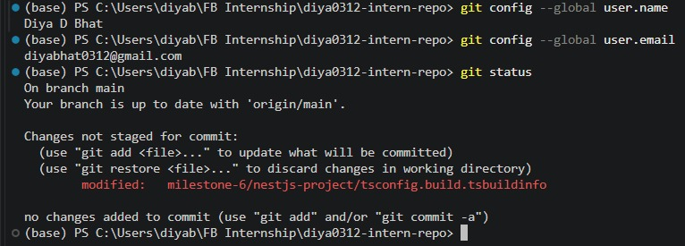

# Git Knowledge

## Git Installation

- Git command-line tools are installed and working.
- Verified using `git --version`.

## Previous Git Experience

- Used Git for university projects, personal projects, and internship work.
- Used GitHub for storing repositories and collaborating on code.
- Familiar with basic commands such as `git status`, `git add`, `git commit`, `git pull`, and `git push`.

## Git Client

- **Chosen client:** Git in VS Code
- **Why:**
  - Already integrated into the development environment.
  - Makes it easy to view changes and manage commits.
  - Provides both the terminal and graphical Source Control interface.
  - Avoids switching between different applications.

## Most Interesting Thing Learned

- Git tracks changes to files using commits rather than simply storing different copies of the project.
- The staging area allows specific changes to be selected before creating a commit.

## Reflection

- Git provides a structured way to track code changes and collaborate using repositories.
- Using Git directly in VS Code makes everyday version-control tasks convenient.