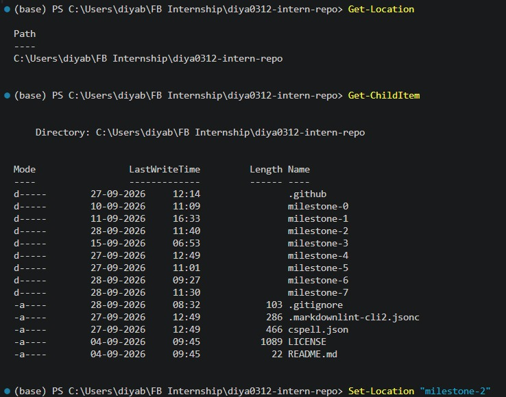
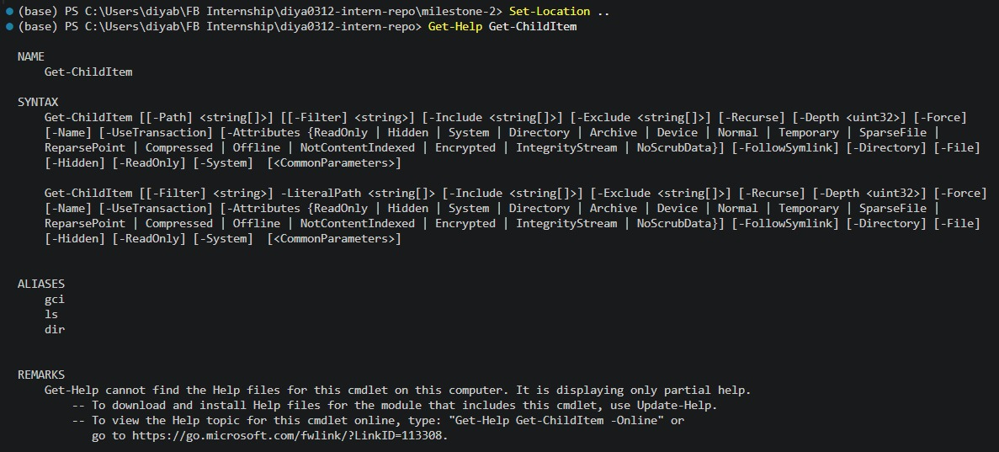

# Terminal Knowledge  

**Milestone:** 2    
**Issue Number:** #50    
**Date:** 28/09/2026  

## Terminal Client

- **Chosen client:** VS Code Integrated Terminal
- **Shell:** PowerShell

## Why I Chose It

- Already integrated into VS Code.
- Keeps the terminal close to the code and project files.
- Convenient for running Git, Node.js, npm, and Docker commands.
- Avoids switching between different applications.

## Customizations

- PowerShell is used as the terminal profile.
- No additional themes, plugins, or aliases were added.

## Basic Commands Learned

- `Get-Location` - Shows the current directory.
- `Get-ChildItem` - Lists files and folders.
- `Set-Location` - Changes the current directory.
- `Get-Help` - Displays help for PowerShell commands.

## Most Useful Command

- **`Get-Help`**
- Helps find information about unfamiliar PowerShell commands and their available options.

## Reflection

- The VS Code Integrated Terminal is convenient because the terminal, code, and project files are available in one place.
- PowerShell can be used for file navigation, Git commands, and running development tools.