# Writing Meaningful Commit Messages

**Milestone:** 3  
**Issue Number:** #62  
**Date:** 14/09/2026

## Goal

Learn how to write clear and meaningful Git commit messages and understand why they are useful when working in a team.

## Research

I looked at the commit history of the React open-source project to see how real projects write commit messages.

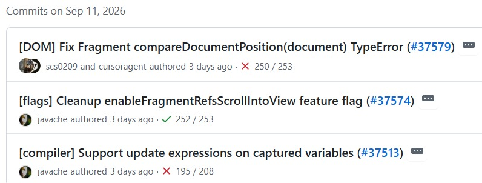

These messages are useful because they clearly describe the area affected and what was changed. I did not find a clearly bad commit message in the examples I looked at. Instead, I used simple messages in my own repository to demonstrate different styles.

## What Makes a Good Commit Message?

A good commit message should:

- Clearly describe the main change.
- Be short and easy to understand.
- Give enough context about what the commit is for.
- Follow a consistent style.
- Make the Git history easier to understand later.

## How Does a Clear Message Help Team Collaboration?

- Team members can quickly understand what was changed.
- It makes code reviews easier.
- It helps when debugging or looking through old commits.
- It makes it easier to find a commit related to a particular change.
- It reduces the need to inspect every commit's code changes just to understand its purpose.

## How Can Poor Commit Messages Cause Problems?

- Vague messages do not explain what was changed.
- It becomes harder to understand the project history.
- Finding a particular change later becomes difficult.
- Debugging and reviewing changes can take more time.
- Overly detailed messages can hide the main purpose of a small change.

## Commit Styles

I created a small file called `commit-message-practice.txt` in my `milestone-3` folder and made three commits with different message styles.

### 1. Vague Commit Message

I created the file and committed it using:

`fixed`

This is vague because it does not explain what was fixed or changed.

### 2. Overly Detailed Commit Message

I added another line to the file and used a deliberately long commit message:

`Updated the commit message practice file by adding a second line that explains that this line was added specifically to demonstrate how an overly detailed commit message can contain unnecessary information about a very small change`

This contains much more information than necessary for such a small change, making the main purpose harder to see quickly.

### 3. Clear Commit Message

I added a third line and committed it using:

`Add clear commit message example`

This is more useful because it is short and clearly describes the purpose of the change.

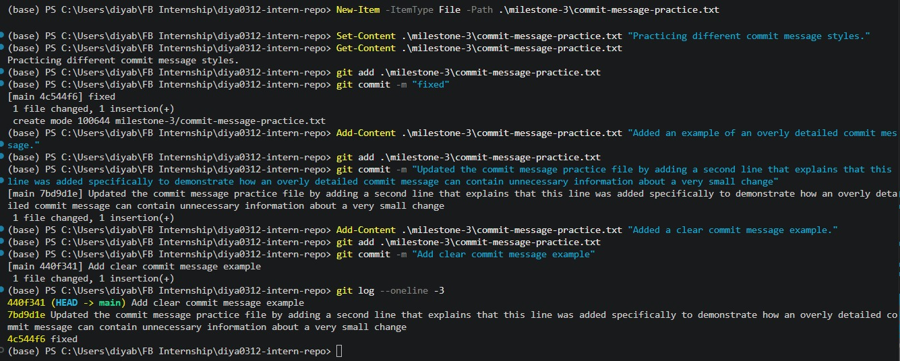

## What I Learned

- Commit messages are an important part of a project's history.
- A vague message can make changes difficult to understand later.
- A very long message can make a simple change harder to understand.
- A good commit message should clearly communicate the purpose of the change without unnecessary detail.
- Looking at commit histories from real open-source projects helped me understand how meaningful messages are used in practice.

---

# Git Bisect

**Issue Number:** #61

## What Does `git bisect` Do?

`git bisect` helps find the commit that introduced a bug by narrowing down the commit history between a known good and bad commit.

I used the CLI to mark a working commit as good and the current buggy version as bad. Git then selected commits for me to test.

## My Test Scenario

I created a small Python program with an `add()` function.

- The first version returned the correct results.
- I added another test case in the second commit.
- In the third commit, I intentionally changed `a + b` to `a - b`, introducing a bug.
- I then made two more commits while the bug was still present.

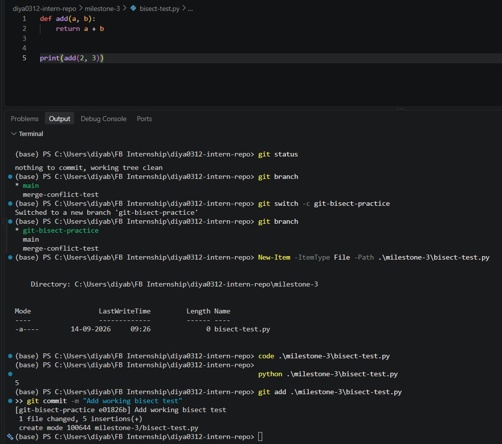

The buggy version produced `-1` and `1` instead of `5` and `9`.

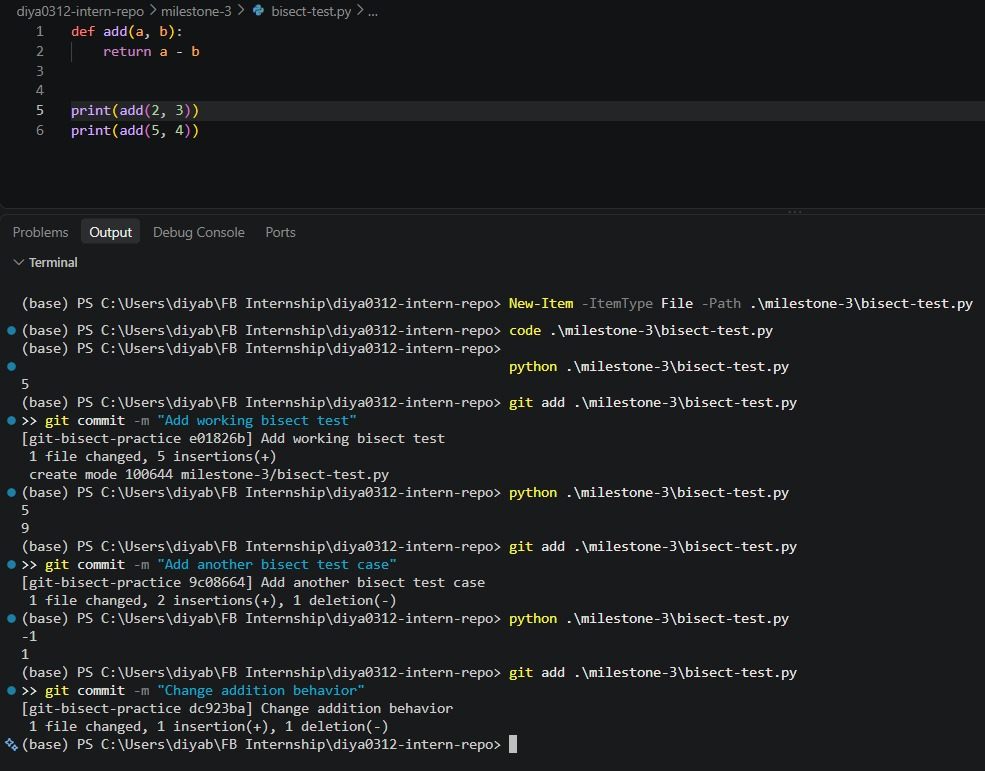

My five commits were:

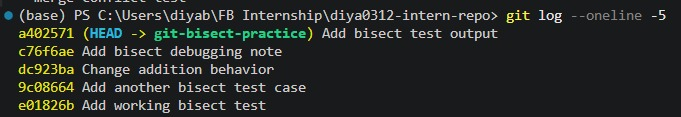

## How I Used `git bisect`

I started bisecting with:

`git bisect start`

I marked the current version as bad:

`git bisect bad`

I marked `e01826b` as a known good commit:

`git bisect good e01826b`

Git selected `dc923ba` for testing. The program produced `-1` and `1`, so I marked it as bad.

Git then selected `9c08664`. The program produced `5` and `9`, so I marked it as good.

Git then identified:

`dc923bae... is the first bad commit`

The commit was `Change addition behavior`, which was the commit where I intentionally introduced the bug.

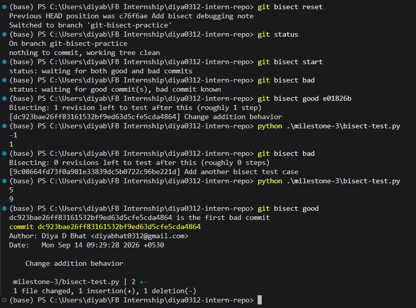

After finishing, I exited bisect mode using:

`git bisect reset`

## When Would I Use Git Bisect?

I would use `git bisect` when a bug exists in the current version but I do not know which earlier commit introduced it.

It is especially useful when a project has many commits and checking them manually would take a lot of time.

## Git Bisect vs Manual Review

- **Git bisect:** Narrows down the possible commits automatically and requires testing selected commits.
- **Manual review:** Requires checking commits one by one.
- `git bisect` is more efficient when there are many commits to investigate.

## What I Learned

- `git bisect` can help identify the commit that introduced a bug.
- I learned how to mark commits as `good` or `bad`.
- The accuracy of bisect depends on correctly testing and classifying each commit.
- I also learned to use `git bisect reset` after finishing the investigation.

---

# Advanced Git Commands & When to Use Them

**Milestone:** 3  
**Issue Number:** #60  
**Date:** 14/09/2026

## `git checkout main -- <file>`

The `git checkout main -- <file>` command restores a specific file to the version that exists on the `main` branch without affecting other files.

### What I Tested

I created a temporary test file called `git-checkout-test.txt` and modified its contents. I then used the checkout command to restore the file from `main`.

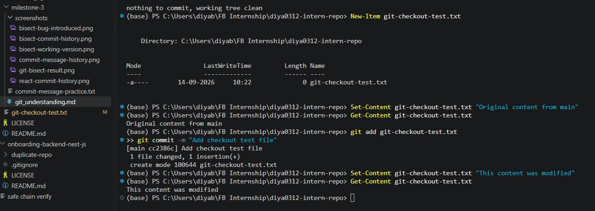

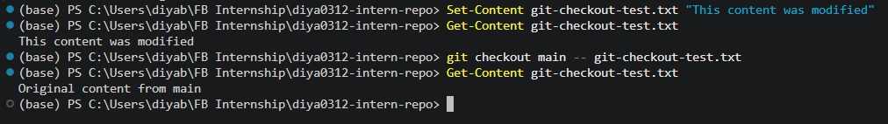

### When Would I Use It?

I would use this when I accidentally modify a file and want to restore only that particular file from `main` without affecting other changes in my working directory.

## `git cherry-pick`

`git cherry-pick` applies the changes introduced by a specific commit onto the current branch without merging the entire branch.

I used cherry-pick while bringing the commits from my Git bisect practice into `main`. I used a commit range so that the required bisect commits could be applied to `main`.

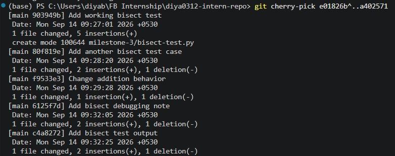

### When Would I Use It?

I would use cherry-pick when I need a specific commit from another branch but do not want to merge all the changes from that branch.

## `git log`

`git log` is used to view the commit history of a Git repository. It helps me understand what changes were made and how the repository evolved over time.

I used `git log` with options to view recent commits in a compact format and understand the commit history.

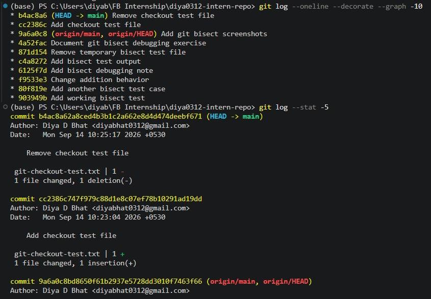

### When Would I Use It?

I would use `git log` when investigating previous changes, finding a particular commit, understanding how a feature evolved, or checking the history before debugging an issue.

## `git blame`

`git blame` shows which commit and author last modified each line of a file.

I used `git blame` on `milestone-3/git_understanding.md` to inspect the history of individual lines in the file.

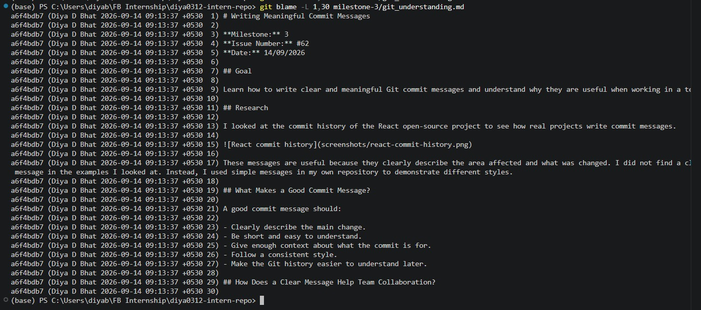

### When Would I Use It?

I would use `git blame` when I need to understand the history of a particular line, find the commit that introduced a change, or investigate changes in an unfamiliar part of a codebase.

## What Surprised Me While Testing?

- I found it useful that `git checkout main -- <file>` can restore one specific file without affecting other files.
- Cherry-pick is useful when I need a particular commit rather than all the changes from a branch.
- `git log` provides a quick way to understand how the repository has changed over time.
- `git blame` provides line-level history, which can be useful when investigating unfamiliar code.
- These commands are especially useful when working in a long-running repository where many developers are making changes.

## What I Learned

I learned that these Git commands are useful for different situations rather than being interchangeable. Checkout can restore a specific file, cherry-pick can apply selected commits, `git log` helps explore repository history, and `git blame` helps trace changes to individual lines. Understanding when to use each command can make it easier to work with and investigate a larger codebase.

---

# Git Staging vs. Committing

**Milestone:** 3  
**Issue Number:** #57  
**Date:** 14/09/2026

## What Is the Difference Between Staging and Committing?

Staging and committing are two separate steps in Git.

**Staging** means selecting the changes that I want to include in the next commit. I used `git add` to move my test file into the staging area.

**Committing** means permanently recording the staged changes in the repository's Git history. I used `git commit` to save the staged change as a commit.

The basic flow is:

**Working directory → Staging area → Repository**

## What I Tested

I created a temporary file called `staging-test.txt` and checked its status before staging it.

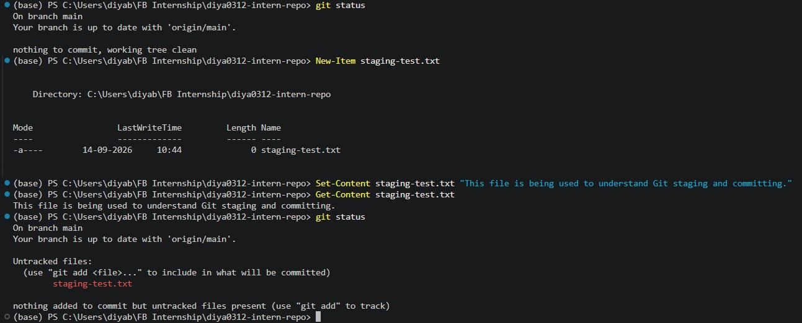

I then used `git add` to stage the file and checked the status again. Git showed the file under changes to be committed.

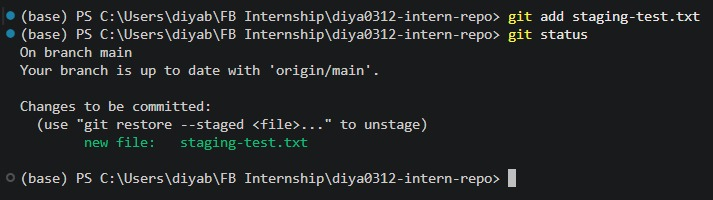

I then used `git reset HEAD -- staging-test.txt` to unstage the file. The file was no longer in the staging area.

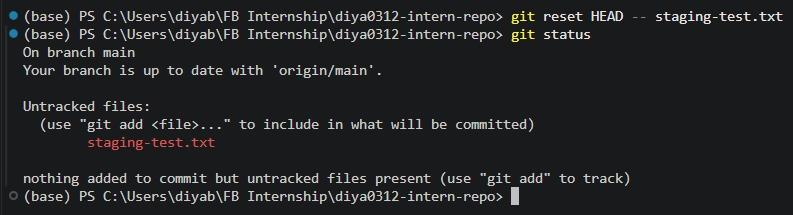

After staging the file again, I committed it using `git commit`. I then checked the repository status and confirmed that there were no remaining changes to commit.

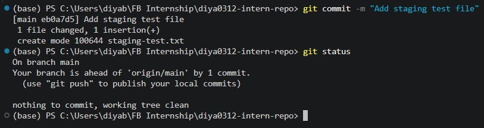

## Why Does Git Separate Staging and Committing?

Git separates these steps so that I can choose exactly which changes should be included in a commit.

This is useful when I have made several changes but only want to commit some of them. The staging area acts as a place where I can review and select the changes before creating a commit.

## When Would I Want to Stage Changes Without Committing?

I might stage changes without immediately committing when I want to:

- Review exactly what will be included in the next commit.
- Select only certain changes from a larger set of modifications.
- Prepare a clean, focused commit.
- Check the staged changes before recording them in Git history.
- Wait until I have verified that the staged changes are ready to commit.

## What I Learned

I learned that staging and committing are different steps. `git add` places selected changes into the staging area, while `git commit` records those staged changes in the repository history.

The staging area is useful because it gives me control over which changes are included in a commit. I also learned how to check the current state using `git status` and how to unstage a file when I do not want it included in the next commit.

---

# Branching & Team Collaboration

**Milestone:** 3  
**Issue Number:** #58  
**Date:** 14/09/2026

## Why Do Teams Use Branches Instead of Pushing Directly to `main`?

Branches allow developers to work on changes separately from the main codebase. This reduces the risk of unfinished or incorrect changes being added directly to `main`.

Pushing directly to `main` can be problematic because it can introduce bugs or incomplete work into the shared branch. It can also make it harder for other team members to review changes before they become part of the main codebase.

## What I Tested

I created and worked on a separate branch called `git-bisect-practice` while working on my Git bisect exercise.

The branch had its own commits while `main` remained a separate branch.

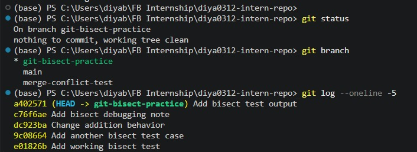

I made and committed the changes while working on the separate branch.

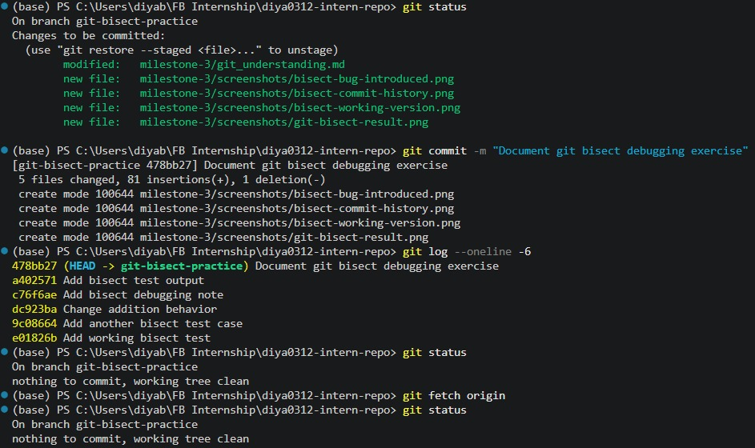

I then switched back to `main` and checked the repository status. Git showed that I was on `main` and that the branch was clean and up to date.

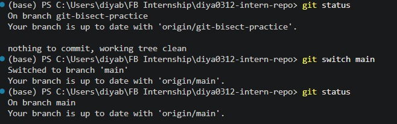

## How Do Branches Help With Reviewing Code?

Branches allow developers to work on a feature or fix without changing the main branch directly. The changes can then be reviewed before being integrated into `main`.

This makes it easier for team members to inspect the changes, discuss them, suggest improvements, and identify problems before they become part of the main codebase.

## What Happens If Two People Edit the Same File on Different Branches?

If two people make changes to the same parts of a file on different branches, Git may not be able to automatically combine the changes. This can result in a merge conflict.

The developers then need to review the conflicting changes and decide how they should be combined.

I also experienced a real merge conflict earlier in Milestone 1, which helped me understand how Git handles conflicting changes between branches.

## What I Learned

I learned that branches provide a safer way to work on changes without directly affecting `main`. They allow developers to keep their work separate, make commits independently, and have changes reviewed before they are integrated into the main codebase.

I also learned that working on separate branches does not automatically prevent conflicts. If multiple developers change the same part of a file, Git may require the conflicting changes to be resolved manually.