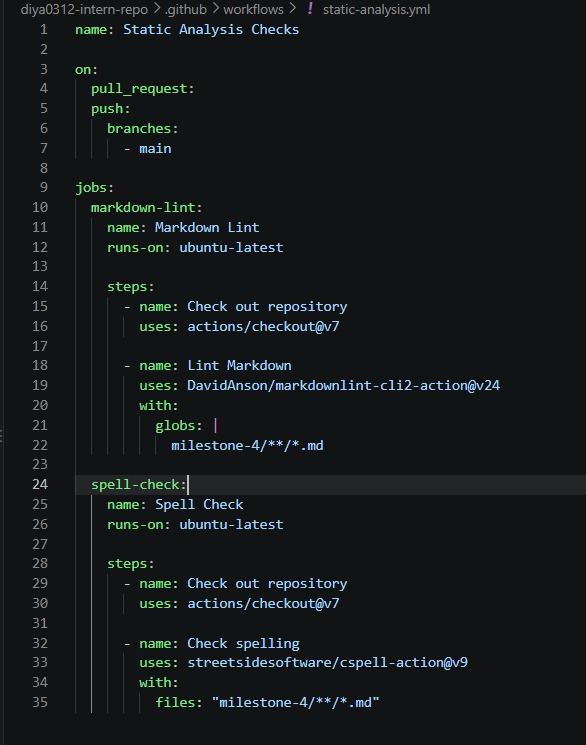
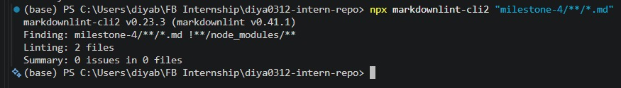
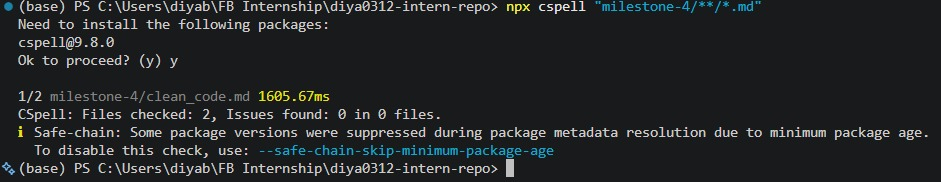
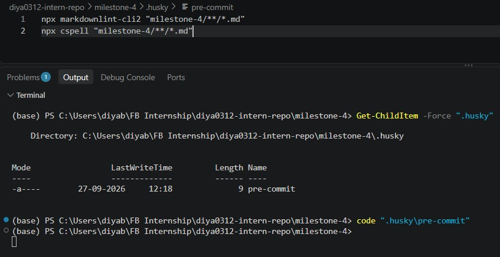
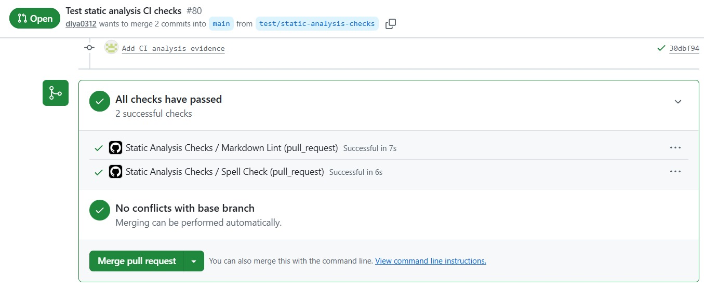
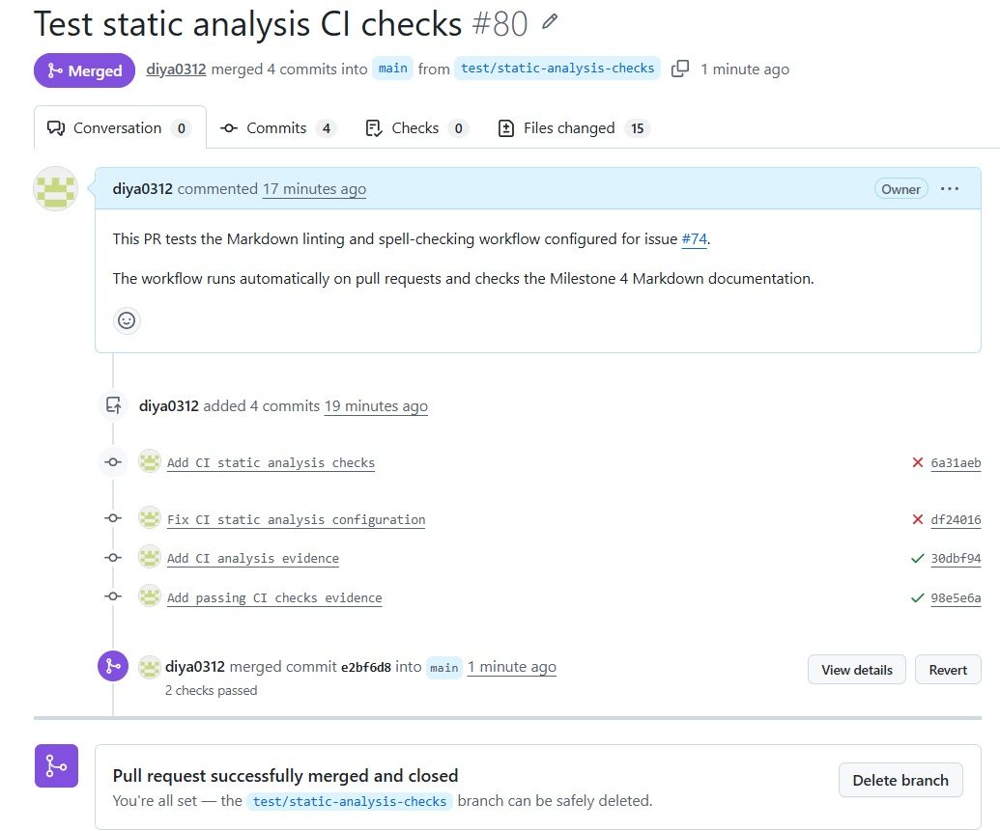

# Static Analysis Checks in CI/CD  

**Milestone:** 4  
**Issue Number:** #74  
**Date:** 27/09/2026

## What is the purpose of CI/CD?

Continuous Integration (CI) is the practice of automatically checking and testing changes when developers push code or create pull requests. It helps identify problems early instead of waiting until changes are merged.

Continuous Deployment (CD) extends this process by automating the delivery or deployment of changes to an environment.

In this task, I focused mainly on the CI part by configuring automated Markdown linting and spell checking for pull requests.

## Markdown Linting and Spell Checking

Markdown linting checks Markdown files for formatting and style problems according to defined rules.

Spell checking identifies words that may be misspelled or unknown to the configured dictionary.

Automating these checks helps keep documentation consistent and reduces small errors that can otherwise be missed during manual review.

## GitHub Actions Workflow

I created a GitHub Actions workflow in:

```text
.github/workflows/static-analysis.yml
```

The workflow runs on pull requests and contains separate jobs for:

- Markdown linting
- Spell checking

The Markdown linting job uses `markdownlint-cli2`, while the spell-checking job uses CSpell.

The workflow configuration can be seen below.



The workflow is configured to run automatically when changes are submitted through a pull request, allowing the repository to perform these checks without requiring them to be run manually every time.

## Local Markdown Linting

Before relying on the GitHub Actions workflow, I tested the Markdown linting process locally using `markdownlint-cli2`.

The command used was:

```bash
npx markdownlint-cli2 "milestone-4/**/*.md"
```

Initially, the linter identified formatting issues in some of the existing Markdown files, such as trailing spaces, multiple consecutive blank lines, and missing final newline characters.

I used the linting tool to fix these formatting issues and then ran the check again to verify that the Markdown files passed the configured rules.



Running the check locally helped verify the configuration before using the same type of check in the CI workflow.

## Local Spell Checking

I also tested the spell-checking process locally using CSpell.

The command used was:

```bash
npx cspell "milestone-4/**/*.md"
```

The CSpell configuration contains project-specific technical terms that should be treated as valid words, such as framework names, development tools, and common technical abbreviations.



Testing the spell checker locally provides an opportunity to identify and resolve spelling issues before creating a pull request.

## Git Hooks and Husky

In addition to the remote CI checks, I experimented with Husky to run static analysis checks before commits.

The pre-commit hook was configured to run the Markdown linting and spell-checking commands before a commit is created.

The relevant hook is located at:

```text
.husky/pre-commit
```

The hook configuration can be seen below.



Using a Git hook provides an additional local validation step. The developer receives feedback before the changes are committed, while GitHub Actions provides another check on the remote repository and pull request.

## Testing the CI Workflow with a Pull Request

A test pull request was created to verify that the GitHub Actions workflow runs automatically when changes are proposed.

The pull request triggered the two configured checks:

- Markdown Lint
- Spell Check

The automated results were reviewed from the pull request to confirm that the configured checks executed successfully.



This demonstrated that the checks were not only working locally but were also being executed automatically by the repository's CI workflow.

## Reviewing and Merging the Test Pull Request

After reviewing the automated checks and confirming that they completed successfully, the test pull request was merged.



This completed the test of the CI workflow from making a change through running automated checks and reviewing the result on a pull request.

## How Automating Style Checks Improves Project Quality

Automated checks provide consistent feedback without depending entirely on a developer remembering to perform the checks manually.

For this project, Markdown linting helps maintain consistent documentation formatting, while spell checking helps identify spelling mistakes.

Running these checks automatically on pull requests means that problems can be identified before changes are merged.

## Challenges with CI/CD Checks

One challenge is that automated tools can sometimes report false positives or flag project-specific technical terms. For example, software names, abbreviations, framework names, and domain-specific terminology may not be present in a spell checker's default dictionary.

Configuration files can be used to define accepted technical terms and adjust linting rules when appropriate.

Another challenge is balancing strict checks with developer productivity. Checks should improve consistency without creating unnecessary friction.

## CI/CD in Small Projects vs Large Teams

In a small project, a CI/CD pipeline may contain only a few basic checks such as linting, tests, and build verification.

In a larger team, the pipeline may contain multiple stages including static analysis, unit tests, integration tests, security checks, builds, deployment, and approval steps.

Larger teams also benefit more from consistent automated checks because many developers may contribute changes simultaneously.

## Reflection

This task helped me understand that CI/CD is not only about deployment. CI can also be used to automatically enforce quality checks whenever changes are proposed.

I also understood the difference between local Git hooks and remote CI checks. Husky can provide immediate feedback before a commit, while GitHub Actions provides a shared automated check that can be reviewed by the team through a pull request.

Using both approaches provides multiple opportunities to catch documentation and quality issues before changes are merged.