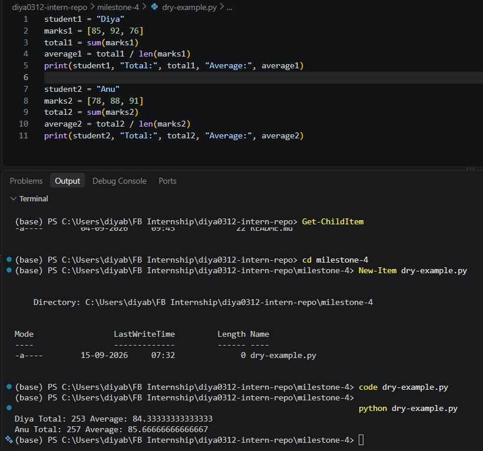
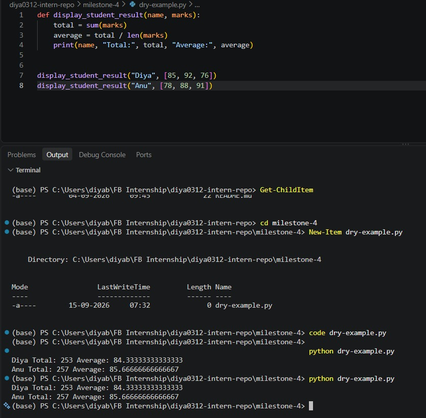
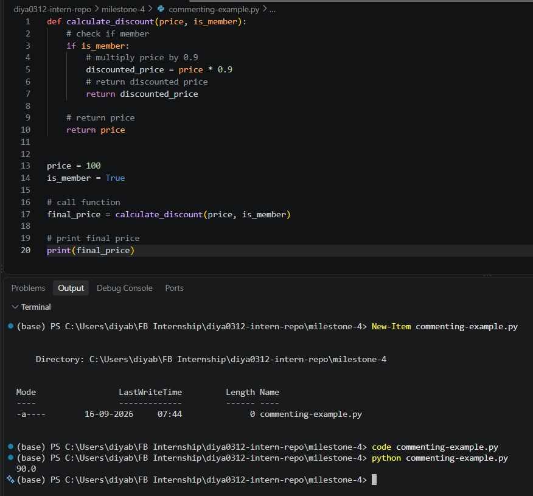
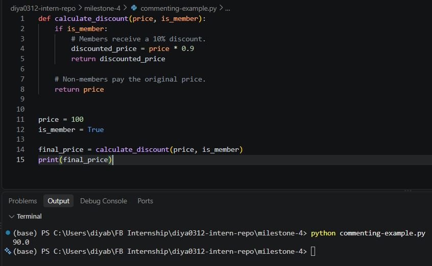

# Understanding Clean Code Principles

**Milestone:** 4  
**Issue Number:** #64  
**Date:** 15/09/2026

## Clean Code Principles

### Simplicity

Keep code as simple as possible and avoid unnecessary complexity.

### Readability

Code should be easy to understand through clear naming, formatting, and structure.

### Maintainability

Code should be easy for future developers to understand, modify, and extend.

### Consistency

Follow consistent naming, formatting, and coding conventions throughout a project.

### Efficiency

Write code that performs well while avoiding unnecessary optimization or premature over-engineering.

## Messy Code Example

I created a small Python example that calculates the sum of even numbers:

`def x(a): t=0 for i in a: if i%2==0: t=t+i print(t)`

The code works, but it is difficult to read because the function and variable names are unclear, the formatting is inconsistent, and the purpose of the code is not immediately obvious.

## Cleaner Version

I rewrote the code using descriptive names, consistent formatting, and a clearer structure:

`def sum_even_numbers(numbers): total = 0 for number in numbers: if number % 2 == 0: total += number return total`

Both versions produce the same result, but the cleaner version is easier to understand and maintain.

## What I Learned

Clean code is not only about making code work. Clear naming, simple structure, consistency, and maintainability make code easier for other developers and for myself to understand and modify later.

---

## Naming Variables & Functions

**Milestone:** 4  
**Issue Number:** #66    
**Date:** 15/09/2026

### Best Practices

Good variable and function names should clearly describe what the value represents or what the function does. Names should be meaningful, specific, and easy to understand without needing extra explanation.

For variables, descriptive names such as `total_price`, `student_count`, or `user_name` are easier to understand than names such as `x`, `n`, or `a`.

For functions, the name should describe the action being performed. For example, `calculate_total()` is clearer than `calc()` or `do_task()`.

### Unclear Naming Example

I created a small Python example with unclear variable and function names. The original version used names such as `x`, `a`, `t`, and `i`. The function name did not explain what the function actually did, making the purpose of the code harder to understand.

### Refactored Version

I renamed the function and variables to make their purpose clear. For example, `x` was changed to `sum_even_numbers`, `a` to `numbers`, `t` to `total`, and `i` to `number`.

The functionality remained the same, but the names now make the code easier to understand without needing additional explanation.

### Reflection

Poorly named variables and functions can make code confusing and increase the time needed to understand, debug, or modify it. They can also make collaboration harder because another developer may not immediately understand what the code is supposed to do.

Refactoring the names improved readability because the purpose of each variable and function became clear from the name itself. This showed me that meaningful naming is an important part of writing clean and maintainable code.

---

## Writing Small, Focused Functions

**Milestone:** 4  
**Issue Number:** #67      
**Date:** 15/09/2026

### Best Practices

A good function should generally have one clear responsibility. Keeping functions small makes them easier to understand, test, debug, and modify. Functions should have clear names that describe what they do and should avoid handling several unrelated tasks at once.

### Long Function Example

I created an example function called `process_student_marks()` that calculated the total, average, highest mark, lowest mark, grade, and displayed the results. Although the function worked correctly, it handled several different responsibilities in one place.

### Refactored Version

I divided the large function into smaller functions such as `calculate_total()`, `calculate_average()`, `find_highest()`, `find_lowest()`, `calculate_grade()`, and `display_results()`. Each function now has a specific responsibility.

The refactored version produces the same output as the original version, but the structure is easier to understand, test, and maintain.

### Reflection

Breaking a large function into smaller focused functions makes the code easier to understand and maintain. Each function can be understood and tested independently, and changes to one responsibility are less likely to affect unrelated parts of the code.

The refactoring improved the structure by separating calculations, grade determination, and output into different functions. This made the overall code more organized and showed me why single-purpose functions are useful for clean code.

---

## Avoiding Code Duplication

**Milestone:** 4  
**Issue Number:** #68        
**Date:** 15/09/2026

### DRY Principle

DRY stands for "Don't Repeat Yourself". It means that the same logic should not be unnecessarily repeated in multiple places. Instead, repeated logic can be placed in a reusable function or another suitable structure.

### Duplicated Code Example

I created a small example in the test repository where the same formatting and calculation logic was repeated for two students. The repeated code made the program longer and meant that changes to the same logic would need to be made in multiple places.

### Refactored Version

I refactored the repeated logic into a reusable function. The function can now be called for different students instead of repeating the same code.

The output remains the same, but the code is shorter and easier to maintain because the logic exists in one place.

### Reflection

Duplicated code can make a program harder to maintain because the same logic may need to be updated in multiple places. It can also increase the chance of inconsistencies if one copy is changed while another is not.

Refactoring the duplicated code improved maintainability by putting the common logic in one reusable function. If the logic needs to change later, it can be updated in one place instead of several copies.

---

## Commenting & Documentation

**Milestone:** 4    
**Issue Number:** #70        
**Date:** 16/09/2026

### Best Practices

Comments should explain information that is not obvious from the code, such as why a particular approach was chosen, an important assumption, or a non-obvious piece of logic. Good documentation should help other developers understand how to use or maintain the code.

Comments should be kept clear, concise, and up to date with the code.

### Poorly Commented Example

I created a small Python example containing comments that only describe what the code is already doing. For example, comments such as "add 1 to total" or "loop through numbers" do not provide useful information because the code itself already makes these actions clear.

### Improved Comments

I rewrote the comments so that they explain the reason behind the logic rather than simply repeating the code. The improved comments provide useful context while leaving straightforward operations self-explanatory.

### Reflection

Comments are useful when they explain why something is done, provide important context, document assumptions, or clarify non-obvious logic. They can also be useful for explaining constraints or decisions that may not be clear from the code itself.

Comments should be avoided when they simply repeat what the code already says. In those cases, improving the variable names, function names, or structure of the code is usually more useful than adding more comments.

This activity showed me that good comments should add information rather than duplicate the code.