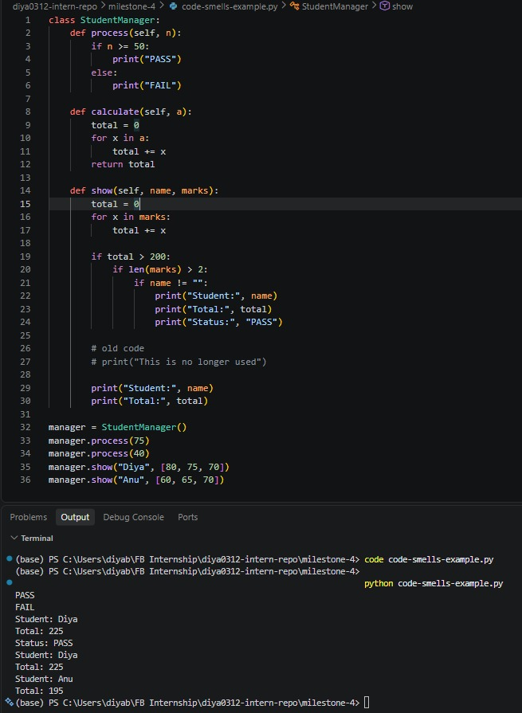
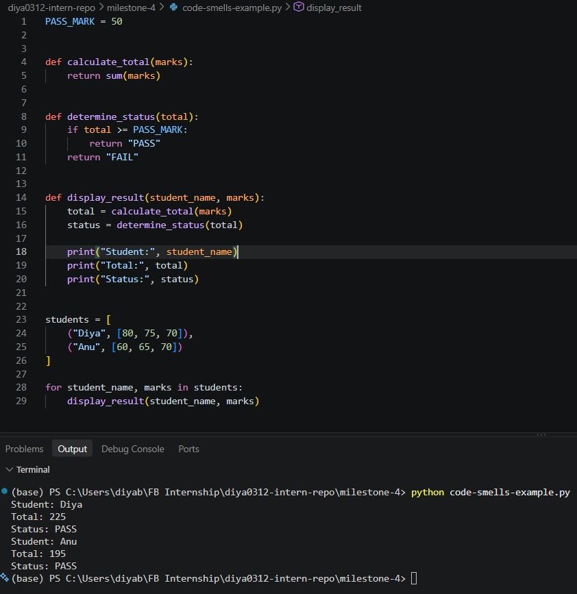

# Identifying & Fixing Code Smells

**Milestone:** 4  
**Issue Number:** #73  
**Date:** 16/09/2026

## Common Code Smells

Code smells are patterns in code that may indicate problems with readability, maintainability, or design. They do not necessarily mean that the code is incorrect, but they can make future changes and debugging more difficult.

### Magic Numbers & Strings

Hardcoded values used directly in the code can make their purpose unclear. Using named constants makes the meaning of these values easier to understand.

### Long Functions

A function that handles too many responsibilities can become difficult to understand, test, and maintain. Such functions can often be divided into smaller focused functions.

### Duplicate Code

Repeating the same logic in multiple places increases maintenance effort because changes may need to be made in several locations.

### Large Classes

A class that handles many unrelated responsibilities can become difficult to maintain. Separating responsibilities into smaller classes can make the design clearer.

### Deeply Nested Conditionals

Multiple levels of nested conditions can make program logic difficult to follow. Guard clauses and simpler conditions can reduce unnecessary nesting.

### Commented-Out Code

Unused commented-out code can clutter a file and make it harder to distinguish active code from old code. Version control can be used to preserve previous versions instead.

### Inconsistent Naming

Using unclear or inconsistent names makes it harder to understand what variables, functions, and other elements represent.

## Code Smells Example

I created a small Python example specifically for this exercise that demonstrates the requested code smells. The example contains hardcoded values, a function handling several responsibilities, repeated logic, deeply nested conditions, commented-out code, and inconsistent naming.

## Refactored Version

I refactored the example by replacing magic values with constants, separating responsibilities into smaller functions, removing duplicated logic and commented-out code, simplifying nested conditions, and using clearer and more consistent names.

## Reflection

The main code smells in the example were magic numbers and strings, a long function, duplicate code, deeply nested conditionals, commented-out code, and inconsistent naming. A small class with multiple responsibilities was also included to demonstrate the large-class code smell.

Refactoring improved readability by making the purpose of values and functions clearer and by separating different responsibilities. It also improved maintainability because changes can be made in a more focused part of the code.

Avoiding code smells can make future debugging easier because the code is easier to understand and individual responsibilities are more clearly separated. This reduces the amount of code that needs to be examined when locating a problem.