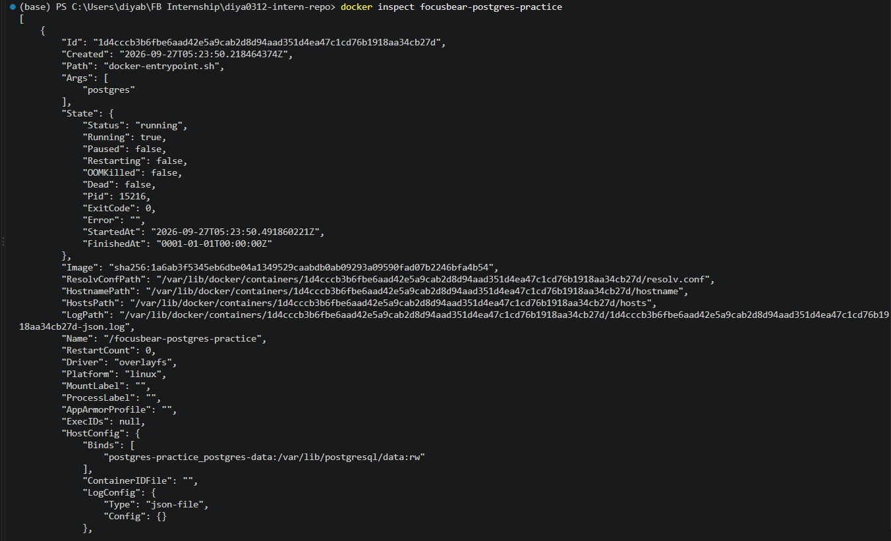
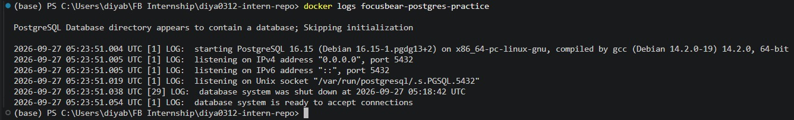
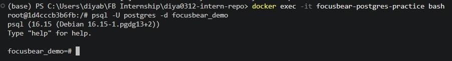
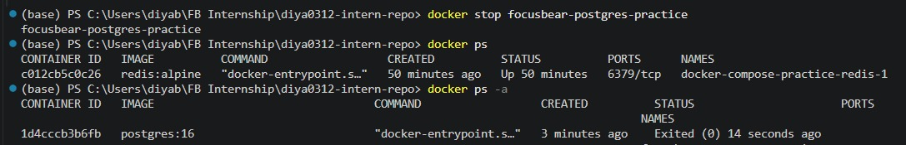
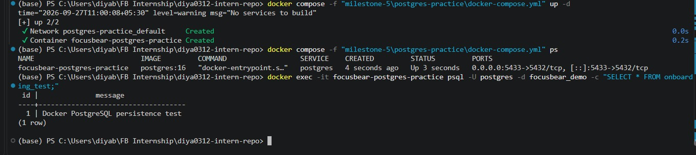

# Debugging & Managing Docker Containers  

**Milestone:** 5  
**Issue Number:** #32  
**Date:** 27/09/2026

## Inspecting Running Containers

The `docker ps` command is used to view currently running Docker containers. The `docker ps -a` command can also be used to view stopped containers.

I used `docker inspect` on the PostgreSQL container to view detailed information about its configuration, state, networking, and mounted volumes.

## Checking Container Logs

The `docker logs` command displays the standard output and error output generated by a container. It is useful when troubleshooting application startup problems, runtime errors, or other unexpected container behaviour.

I used `docker logs` to inspect the PostgreSQL container's output.

## Entering a Running Container

The `docker exec -it` command allows a command to be executed inside an already running container.

I used `docker exec -it` to enter the PostgreSQL container and then connected to the `focusbear_demo` database using `psql`.

This is useful for troubleshooting because it allows developers to inspect the environment and interact directly with services running inside a container.

## Stopping and Restarting Containers

I used `docker stop` to stop the PostgreSQL container and then used `docker start` to start the same container again.

The container could be stopped and restarted without losing the PostgreSQL data because the database uses a named Docker volume.

## Recreating Containers with Docker Compose

Docker Compose can be used to stop and remove the containers and networks belonging to a Compose application using `docker compose down`.

The application can then be started again using `docker compose up -d`.

For this task, I recreated the PostgreSQL container using this process without removing its named volume.

After the container was recreated, I queried the database and confirmed that the test data was still available.

## docker exec vs docker attach

`docker exec` runs a new command inside an already running container. It is useful when a developer wants to open a shell, run a database client, inspect files, or execute a specific command without taking over the container's main process.

`docker attach` connects the terminal to the container's existing main process. This can be useful for interacting with the main process directly, but it is generally less suitable for routine debugging tasks where a separate shell or command is needed.

In this task, I used `docker exec` because I wanted to open a shell and connect to PostgreSQL without interfering with the container's main process.

## Restarting a Container Without Losing Data

A container can be restarted using `docker restart` or stopped and started again using `docker stop` followed by `docker start`.

Whether data is preserved depends on how the application stores its data. In the PostgreSQL setup used for this task, the database data is stored in a named Docker volume.

I verified that the PostgreSQL test data remained available after stopping and restarting the container and after recreating the container using Docker Compose.

## Troubleshooting Database Connection Issues in a Containerized NestJS Application

When troubleshooting a database connection problem in a containerized NestJS application, I would first check whether the PostgreSQL container is running using `docker ps` or `docker compose ps`.

I would then inspect the PostgreSQL logs using `docker logs` or `docker compose logs` to look for startup or connection-related errors.

Next, I would inspect the container configuration and network information using `docker inspect`. I would also check the database host, port, username, password, and database name configured for the NestJS application.

If necessary, I would use `docker exec` to enter the relevant container and test whether the database can be reached from inside the containerized environment.

Common areas to check include:

- Whether the PostgreSQL container is running.
- Whether the NestJS application is using the correct database hostname.
- Whether the correct database port is configured.
- Whether the database name and credentials are correct.
- Whether the containers are connected to the same Docker network.
- Whether PostgreSQL is ready to accept connections.
- Whether PostgreSQL logs show startup or authentication errors.

## Reflection

### How can you check logs from a running container?

The `docker logs <container-name>` command can be used to view the output of a running container. With Docker Compose, `docker compose logs` can be used to inspect service logs.

### What is the difference between docker exec and docker attach?

`docker exec` starts a new command inside an already running container, while `docker attach` connects the terminal to the container's existing main process. For debugging and running individual commands, `docker exec` is generally more flexible.

### How do you restart a container without losing data?

A container can be restarted using `docker restart` or by stopping and starting it again. Data can persist when it is stored in a Docker volume rather than only in the container's writable layer. In my PostgreSQL experiment, the named volume preserved the database data.

### How can you troubleshoot database connection issues inside a containerized NestJS app?

I would first verify that the database container is running, inspect its logs and configuration, check the database credentials and connection settings used by NestJS, verify the Docker network, and use `docker exec` to test the database connection from inside the relevant container.

## Screenshots

- `screenshots/docker-inspect.png` — Inspecting the PostgreSQL container.
- `screenshots/docker-debug-logs.png` — Checking PostgreSQL container logs.
- `screenshots/docker-exec.png` — Entering the running PostgreSQL container and accessing `psql`.
- `screenshots/docker-stop-restart.png` — Stopping and restarting the PostgreSQL container.
- `screenshots/docker-recreate-persistence.png` — Recreating the container with Docker Compose and verifying that database data persisted.