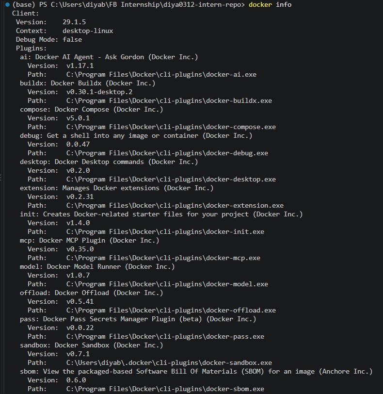

# Docker Introduction

**Milestone:** 5    
**Issue Number:** #36   
**Date:** 27/09/2026  

## What is Docker?

Docker is a platform used to package and run applications in isolated environments called containers. A container includes the application and the dependencies needed to run it while sharing the host operating system's kernel.

Docker helps developers create environments that are more consistent between development, testing, and deployment.

## Docker vs Virtual Machines

Docker containers and virtual machines both provide isolation, but they work differently.

A virtual machine includes a complete guest operating system on top of a hypervisor. This means each virtual machine contains its own operating system and typically requires more system resources.

Docker containers share the host operating system's kernel while keeping applications and their dependencies isolated. Because containers do not require a complete guest operating system for each application, they are generally lighter and faster to start than virtual machines.

## Docker Environment

I verified that Docker and Docker Compose are available in my development environment.

I also inspected the Docker engine information using `docker info`.

## Why Containerization is Useful for Backend Development

Containerization is useful for backend development because it provides an isolated and reproducible environment for running backend services.

A backend application may depend on specific versions of programming languages, libraries, databases, or other services. Installing all of these dependencies directly on every developer's computer can lead to differences between environments.

With Docker, these dependencies can be defined as part of the containerized environment. This makes it easier for developers to work with a consistent setup.

## How Containers Help with Dependency Management

Containers help with dependency management by keeping application dependencies inside the container environment instead of requiring every dependency to be installed directly on the host machine.

A backend can specify the required runtime and dependencies as part of its container configuration. Other developers can then use the same configuration instead of manually recreating the environment.

This reduces environment-related differences and makes development setup more reproducible.

## How Focus Bear Uses Docker

Focus Bear's backend development environment uses Docker containers to help provide consistency between development environments.

The use of containers allows backend services and their dependencies to be defined in a reproducible environment rather than relying entirely on each developer's individual machine configuration while also providing isolation.

## Potential Downsides of Docker

Although Docker provides several benefits, there are also potential disadvantages:

- Docker adds another layer of tooling that developers need to understand.
- Container configuration can become complicated for applications with many services.
- Docker can consume significant system resources when multiple containers are running.
- Debugging containerized applications can sometimes be more complicated than debugging a locally running application.
- Incorrect configuration of networking, volumes, permissions, or environment variables can cause development problems.

## Reflection

Docker provides a consistent way of packaging and running applications and their dependencies. Compared with virtual machines, containers generally require fewer resources because they share the host operating system's kernel.

For backend development, containerization is useful because it reduces differences between development environments and makes dependencies easier to reproduce.

I also learned that Docker itself does not require every project to use Docker Compose. Compose is an additional tool for defining and managing applications that use multiple containers. For this introductory task, I focused on understanding Docker and verifying my Docker environment rather than creating a new Compose application.

## Screenshots

- `screenshots/docker-version.png` — Docker and Docker Compose version information.
- `screenshots/docker-info.png` — Docker engine information.