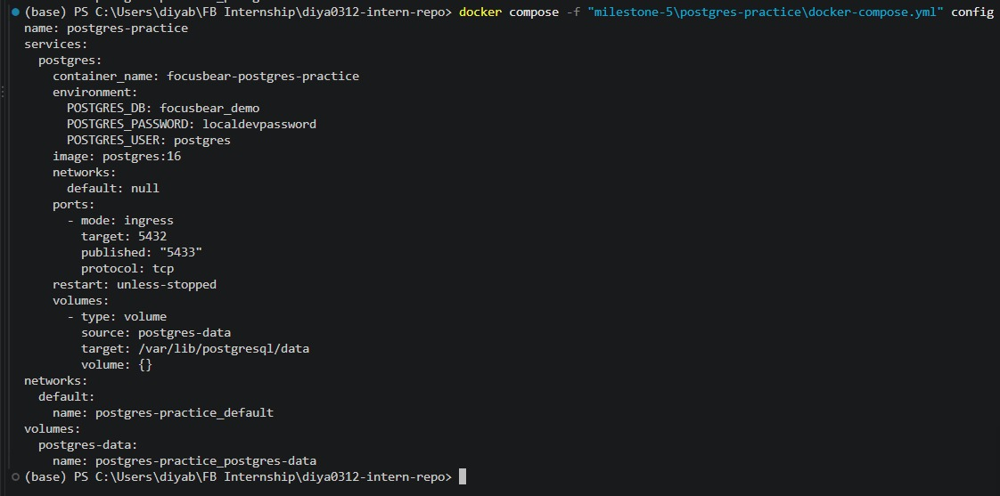
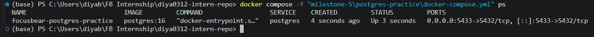
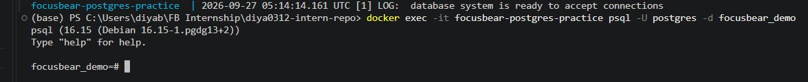
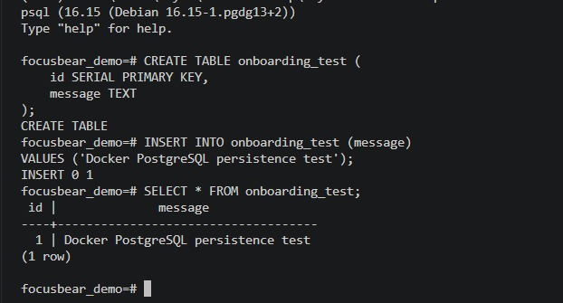
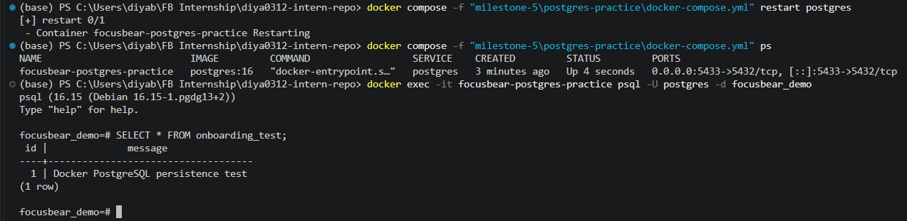

# Running PostgreSQL in Docker  

**Milestone:** 5  
**Issue Number:** #34  
**Date:** 27/09/2026

## Setting Up PostgreSQL with Docker Compose

For this task, I created a small PostgreSQL Docker Compose setup to understand how PostgreSQL can be run in a container for local development.

The Compose configuration uses the official PostgreSQL Docker image and defines the PostgreSQL user, password, database, port mapping, and a named volume for persistent database storage.

## Running PostgreSQL

I started the PostgreSQL service using Docker Compose and verified that the container was running successfully.

The PostgreSQL container was exposed on port `5433` on the host and mapped to PostgreSQL's default port `5432` inside the container.

## Connecting to PostgreSQL

I connected to the running PostgreSQL instance using the `psql` client available inside the PostgreSQL container.

Using `psql` allowed me to interact directly with the database and execute SQL commands.

## Creating and Querying Data

I created a test table and inserted a sample record into the PostgreSQL database.

I then queried the table to verify that the data had been stored successfully.

## Docker Volumes and Data Persistence

The PostgreSQL service uses a named Docker volume mounted at `/var/lib/postgresql/data`.

I tested persistence by inserting data into the database, restarting the PostgreSQL container, and querying the database again.

The test record was still available after the container restart.

This demonstrates that the database data is stored in the named volume rather than only in the temporary writable layer of the container.

## Benefits of Running PostgreSQL in Docker

Running PostgreSQL in Docker provides several benefits:

- PostgreSQL can be run without installing the database server directly on the host machine.
- The database environment can be defined in a reproducible Docker configuration.
- A specific PostgreSQL version can be selected through the Docker image.
- The database can be started, stopped, and recreated using Docker commands.
- Named volumes allow database data to persist independently of the container lifecycle.
- Docker makes it easier to keep development environments consistent across different machines.

## How Docker Volumes Persist PostgreSQL Data

Docker volumes provide persistent storage that exists separately from the container itself.

For PostgreSQL, the volume is mounted to the database's data directory. This means that removing or recreating the container does not necessarily remove the database data stored in the volume.

In my experiment, the data remained available after restarting the PostgreSQL container because the database used a named volume.

## Connecting to a Running PostgreSQL Container

A PostgreSQL container can be accessed using a database client such as `psql` or a graphical client such as pgAdmin.

For this task, I used `psql` from inside the running PostgreSQL container:

`docker exec -it focusbear-postgres-practice psql -U postgres -d focusbear_demo`

This allowed me to connect to the database and execute SQL commands without installing PostgreSQL directly on my Windows system.

## Reflection

### What are the benefits of running PostgreSQL in a Docker container?

Running PostgreSQL in Docker provides an isolated and reproducible database environment. It avoids requiring PostgreSQL to be installed directly on the host machine and makes it easier to use a specific database version.

### How do Docker volumes help persist PostgreSQL data?

Docker volumes store data outside the container's temporary writable layer. By mounting a named volume to PostgreSQL's data directory, database data can remain available when the container is restarted or recreated.

### How can you connect to a running PostgreSQL container?

A running PostgreSQL container can be accessed using a client such as `psql`. In this task, I used `docker exec` to start `psql` inside the running container and connected to the `focusbear_demo` database.

## Screenshots

- `screenshots/postgres-compose-config.png` — PostgreSQL Docker Compose configuration and validation.
- `screenshots/postgres-running.png` — PostgreSQL container running through Docker Compose.
- `screenshots/postgres-connection.png` — Successful connection to PostgreSQL using `psql`.
- `screenshots/postgres-data.png` — Creating, inserting, and querying test database data.
- `screenshots/postgres-persistence.png` — Verifying that database data remained available after restarting the PostgreSQL container.