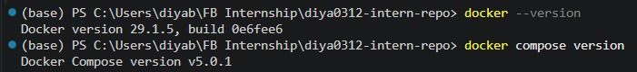
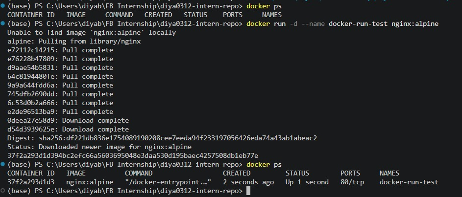
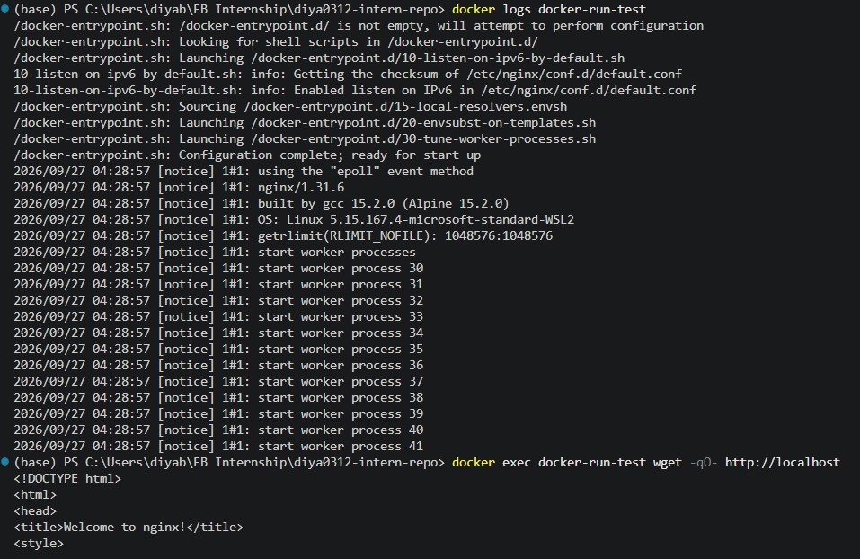
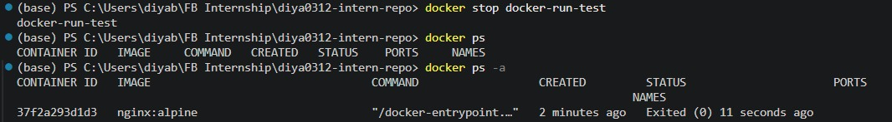
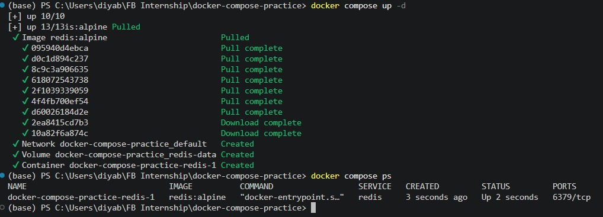
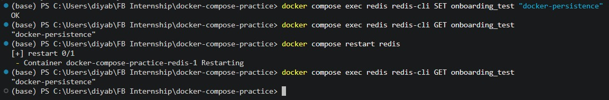

# Setting Up Docker and Docker Compose

**Milestone:** 5    
**Issue Number:** #35    
**Date:** 27/09/2026  

## Docker and Docker Compose Installation

Docker and Docker Compose were already installed in my development environment. I verified their versions before working with containers.

## Verifying Docker and Running Containers

I used `docker ps` to check the containers currently running on the system.

I then used `docker run` to create and start a temporary Nginx container. This helped me understand how a single container can be created directly from a Docker image.

## Key Docker Commands

### docker ps

`docker ps` displays the containers that are currently running. The `docker ps -a` command can also be used to display stopped containers.

### docker run

`docker run` creates and starts a new container from a specified Docker image. It is useful when working with an individual container.

### docker logs

`docker logs` displays the output generated by a container. This is useful for checking application activity and identifying problems when a container is running.

### docker stop

`docker stop` stops a running container without removing it. The container can still be viewed using `docker ps -a` and can be removed separately using `docker rm`.

## Docker Compose

Docker Compose is used to define and manage applications that consist of multiple services. Instead of starting each service individually, the services and their configuration can be described in a Compose file and managed together.

For this task, I created a small Docker Compose practice setup with a Redis service and a named volume. This allowed me to understand how Compose can manage a service and its associated persistent data.

## docker run vs docker compose up

`docker run` is generally used to create and start an individual container directly from an image.

`docker compose up` is used to create and start the services defined in a Compose configuration. This makes it more convenient when an application consists of multiple related services.

For example, a backend application may require an API, a database, and a cache. Docker Compose allows these services to be defined together and started as part of the same application setup.

## How Docker Compose Helps with Multiple Services

Docker Compose simplifies multi-container applications by allowing services, networks, volumes, ports, and other configuration to be defined in one Compose file.

This means that instead of manually starting each service and configuring their relationships separately, developers can use Compose to manage the application as a group.

This is particularly useful for backend applications that depend on services such as PostgreSQL, Redis, and an API.

## Checking Container Logs

Container logs can be checked using commands such as:

- `docker logs <container-name>`
- `docker compose logs`
- `docker compose logs <service-name>`

These commands help developers inspect application output and investigate problems without needing to enter the container itself.

## Container Restart and Data Persistence

I tested data persistence using the Redis service in the Docker Compose practice setup.

I stored a test value in Redis, retrieved it successfully, restarted the Redis container, and retrieved the value again.

The value was still available after the container restart because the Redis service used a named Docker volume for its data.

This showed that restarting a container does not necessarily remove its stored data. Data persistence depends on how storage is configured. A named volume can keep data outside the lifecycle of the container itself.

## Reflection

### What is the difference between docker run and docker compose up?

`docker run` is mainly used to create and start an individual container directly from an image. `docker compose up` manages the services defined in a Compose configuration and is more suitable for applications containing multiple related services.

### How does Docker Compose help when working with multiple services?

Docker Compose allows multiple services and their configuration to be defined together. It simplifies starting, stopping, and managing services that need to work together, such as an API, database, and cache.

### What commands can you use to check logs from a running container?

For an individual container, `docker logs <container-name>` can be used. With Docker Compose, `docker compose logs` or `docker compose logs <service-name>` can be used to view service output.

### What happens when you restart a container? Does data persist?

Restarting a container does not automatically remove its data. Whether data persists depends on how storage is configured. In my experiment, the Redis data persisted after restarting the container because it was stored using a named Docker volume.

## Screenshots

- `screenshots/docker-version.png` — Docker and Docker Compose version verification.
- `screenshots/docker-run-ps.png` — Creating a container with `docker run` and checking it with `docker ps`.
- `screenshots/docker-logs.png` — Checking container output using `docker logs`.
- `screenshots/docker-stop.png` — Stopping a running container and checking its status.
- `screenshots/docker-compose-up.png` — Starting and checking the Docker Compose service.
- `screenshots/docker-persistence.png` — Testing data persistence across a container restart.