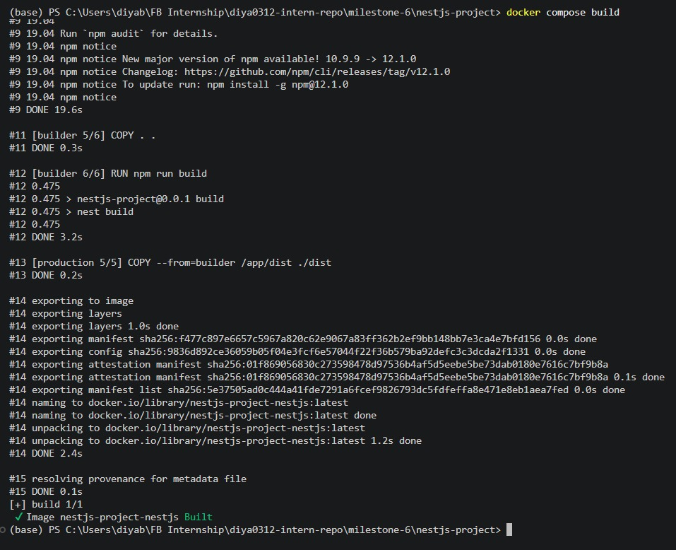
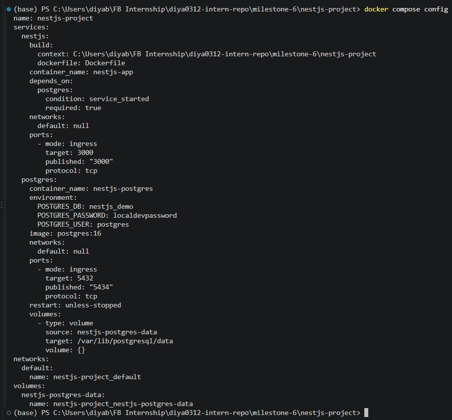
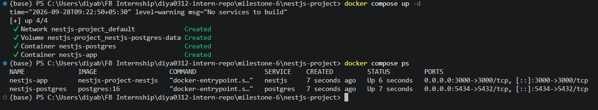
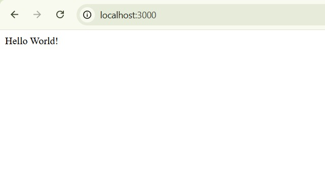
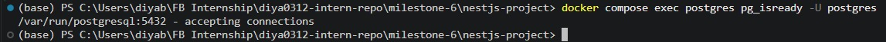
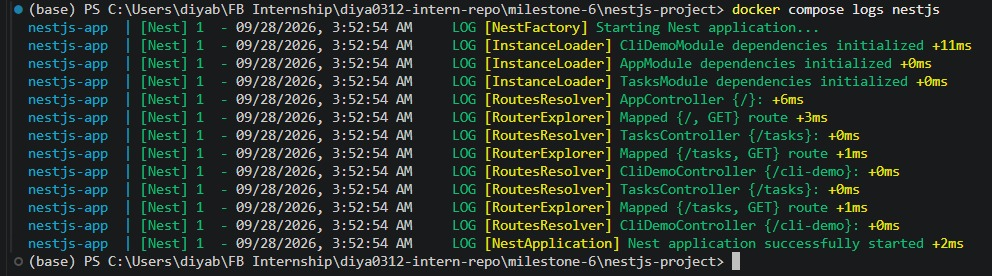

# Using Docker for NestJS Development

**Milestone:** 6  
**Issue Number:** #33  
**Date:** 28/09/2026

## Dockerizing a NestJS Application

Docker allows a NestJS application to run inside an isolated container with its required runtime environment.

For this task, a Dockerfile was created for the NestJS application. The Dockerfile installs the project dependencies, builds the TypeScript application, and creates a production image containing the compiled application and production dependencies.

The application exposes port `3000`, allowing the NestJS API to be accessed from the host machine.

### Dockerfile

The Dockerfile uses Node.js with Alpine Linux as the base image. The application source code and package files are copied into the build environment, dependencies are installed, and the NestJS application is compiled using `npm run build`.

The production stage then copies the compiled application and installs only production dependencies.

The main Dockerfile structure is:

    FROM node:22-alpine AS builder

    WORKDIR /app

    COPY package*.json ./

    RUN npm ci

    COPY . .

    RUN npm run build

    FROM node:22-alpine AS production

    WORKDIR /app

    ENV NODE_ENV=production

    COPY package*.json ./

    RUN npm ci --omit=dev

    COPY --from=builder /app/dist ./dist

    EXPOSE 3000

    CMD ["node", "dist/main.js"]

The Dockerfile separates the build environment from the production runtime environment.

## Multi-Stage Builds

A multi-stage Docker build separates compilation from runtime execution.

The first stage contains the dependencies and tools required to build the NestJS application. The second stage starts from a clean Node.js image and copies only the compiled application and production dependencies.

This can reduce the size of the final image and prevents unnecessary build-time dependencies from being included in the production runtime.

The NestJS Docker image was successfully built using:

    docker compose build

## Docker Compose

Docker Compose simplifies running multiple related services together.

For this task, Docker Compose was used to define the NestJS application and PostgreSQL as separate services.

The services are:

- `nestjs` - the container running the NestJS application.
- `postgres` - the PostgreSQL database container.

Docker Compose also creates a shared network for the services, allowing containers to communicate using their service names.

The PostgreSQL service can therefore be addressed from another container using:

    postgres:5432

The NestJS API is exposed to the host through port `3000`.

The Compose configuration was validated using:

    docker compose config

## Running NestJS and PostgreSQL Together

Both services were started using:

    docker compose up -d

Their status was then checked using:

    docker compose ps

The output confirmed that the NestJS and PostgreSQL containers were running.

## Testing the NestJS API

The NestJS application exposes port `3000` from the container to the host machine.

The API was tested through:

    http://localhost:3000

The existing NestJS application returned its default response, confirming that the application was running successfully inside the Docker container and that the port mapping was working.

## PostgreSQL Container

The PostgreSQL service uses the following development configuration:

- Database: `nestjs_demo`
- User: `postgres`
- Host port: `5434`
- Container port: `5432`

A named Docker volume is used for PostgreSQL data persistence.

The PostgreSQL container was checked using:

    docker compose exec postgres pg_isready -U postgres

The database reported that it was accepting connections.

## Logs and Debugging

Docker Compose provides commands for inspecting logs from individual services.

NestJS logs were viewed using:

    docker compose logs nestjs

This allowed the application startup messages to be inspected and helped confirm that NestJS started successfully inside the container.

PostgreSQL logs can similarly be viewed using:

    docker compose logs postgres

The overall status of the services can be checked using:

    docker compose ps

These commands are useful for identifying application startup problems, configuration issues, connection errors, and other runtime problems.

## Docker Compose Configuration and Service Communication

The Compose configuration keeps the NestJS application and PostgreSQL database together as part of one development environment.

The NestJS container can communicate with PostgreSQL using the Compose service name rather than `localhost`. This is because `localhost` inside the NestJS container refers to the NestJS container itself, while `postgres` refers to the PostgreSQL service on the Compose network.

This separation also makes it easier to start, stop, inspect, and debug both services using Docker Compose commands.

## Reflection

A Dockerfile defines the environment and instructions required to build and run a containerized NestJS application.

The multi-stage build separates compilation from runtime execution, allowing the final image to contain only the files and production dependencies needed to run the application.

Docker Compose makes it easier to run the NestJS application and PostgreSQL together because both services can be defined in one configuration file and started with a single command.

Docker logs and container status commands provide useful information when debugging a containerized application. They make it possible to inspect startup messages, errors, and the current state of individual services.

The setup also demonstrated how containerized services communicate through a Docker Compose network using service names.