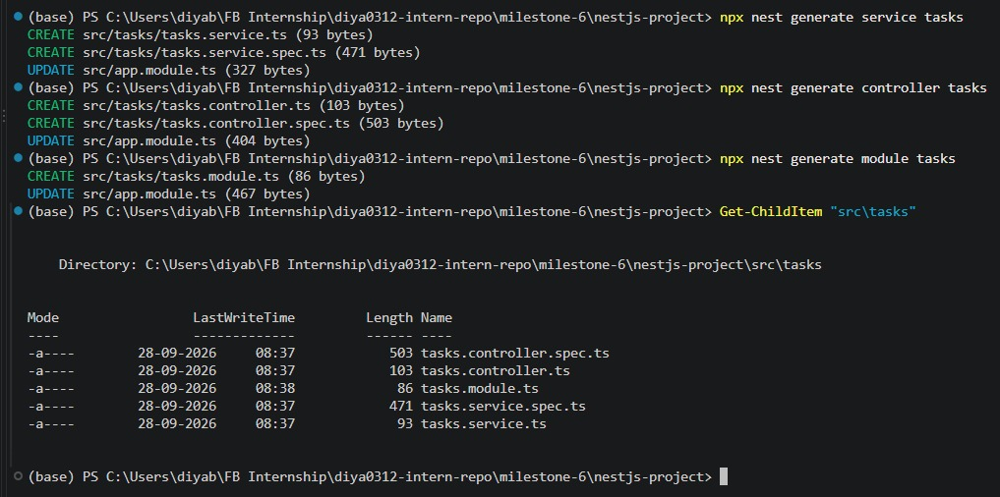
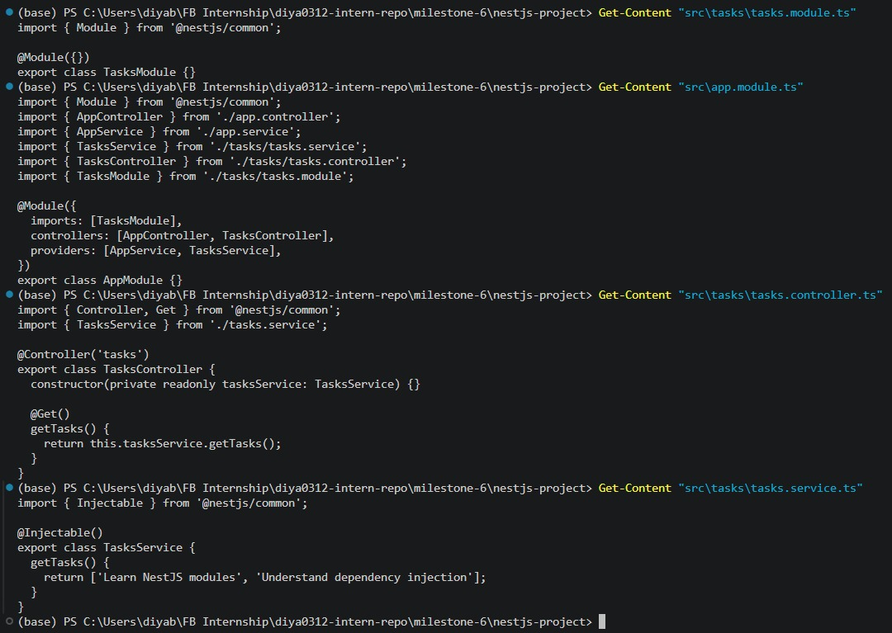
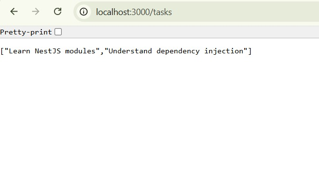

# NestJS Architecture: Modules, Controllers, and Providers

**Milestone:** 6  
**Issue Number:** #44  
**Date:** 28/09/2026

## Modules, Controllers, and Providers

NestJS uses modules, controllers, and providers to organize backend applications into separate responsibilities. In this activity, I created a simple `TasksModule` containing a `TasksController` and `TasksService`.

## Modules

A module is a class decorated with `@Module()`. It organizes related parts of an application and defines which controllers and providers belong to that module.

The `TasksModule` groups the task-related controller and service together. The module is then imported into the root `AppModule`.

NestJS modules help create clear feature boundaries and make larger applications easier to organize.

## Controllers

A controller is responsible for handling incoming HTTP requests. In this activity, `TasksController` handles requests to the `/tasks` route.

The controller delegates the actual task-related logic to `TasksService` rather than containing that logic itself.

## Providers

Providers are classes that NestJS can manage and inject as dependencies. Services are a common type of provider.

In this activity, `TasksService` is marked with `@Injectable()` and contains the logic for returning the task data.

## Decorators

The activity demonstrated three important NestJS decorators:

- `@Module()` defines the metadata for a module.
- `@Controller()` identifies a class as an HTTP controller and defines its route prefix.
- `@Injectable()` allows a class to be managed by NestJS's dependency injection system.

## Dependency Injection

The `TasksController` receives `TasksService` through its constructor:

`constructor(private readonly tasksService: TasksService)`

Instead of manually creating a `TasksService` instance, the controller declares that it needs the service and NestJS resolves the dependency.

This reduces direct coupling between the controller and the service and allows responsibilities to remain separated.

## Testing the Feature

I ran the NestJS development server and tested the `/tasks` endpoint. The controller successfully received the injected service and returned the task data.

## Reflection

A module provides the organizational boundary for a feature, a controller handles incoming requests, and a provider contains reusable application logic that can be injected where needed.

Dependency injection is useful because classes do not need to manually construct their dependencies. NestJS manages those relationships through its dependency injection container.

This structure supports separation of concerns because HTTP handling, business logic, and feature organization are kept in separate components. As an application grows, additional feature modules can be added without placing all controllers and services into one large structure.
