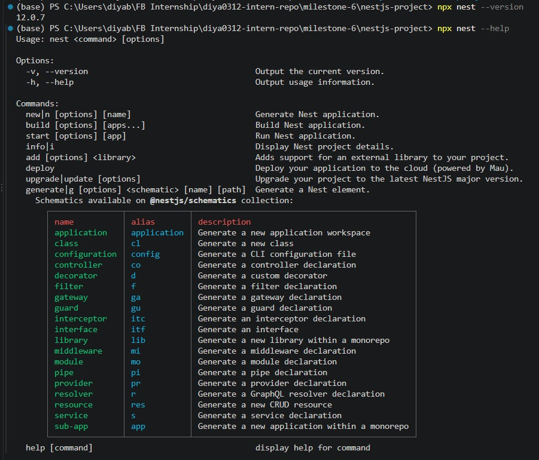
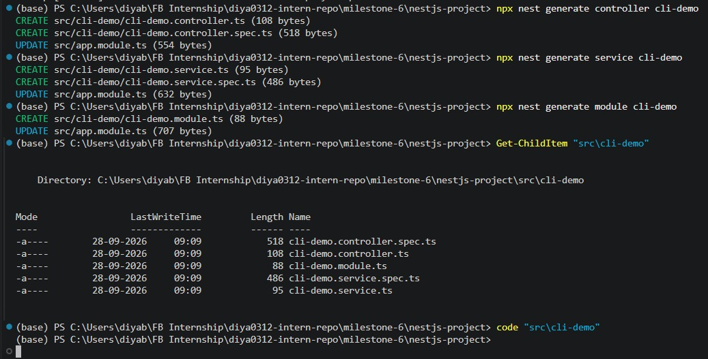
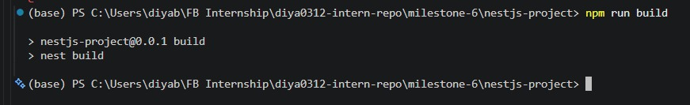

# Using NestJS CLI for Scaffolding

**Milestone:** 6  
**Issue Number:** #42  
**Date:** 28/09/2026

## NestJS CLI

The NestJS CLI is a command-line tool that helps developers create and manage NestJS applications and their components. It provides commands for generating common application building blocks and for performing development tasks such as building and running the application.

Using the CLI helps reduce repetitive setup work and provides a consistent structure for generated components.

## Using `nest generate`

The `nest generate` command is used to create different NestJS application components.

For this task, the following commands were used:

    npx nest generate controller cli-demo

    npx nest generate service cli-demo

    npx nest generate module cli-demo

These commands generated a controller, service, and module for the `cli-demo` feature.

The CLI also generated corresponding test specification files for the controller and service.

## Generated Structure

The CLI created the following structure:

    cli-demo/
    ├── cli-demo.controller.ts
    ├── cli-demo.controller.spec.ts
    ├── cli-demo.service.ts
    ├── cli-demo.service.spec.ts
    └── cli-demo.module.ts

The generated files provide a starting point for implementing the feature while following the standard NestJS project structure.

## Purpose of `nest generate`

`nest generate` helps streamline development by automatically creating commonly used NestJS components.

Instead of manually creating files and writing the initial class structure, decorators, imports, and test files, the CLI generates the required boilerplate.

This allows developers to focus more on implementing application-specific logic.

## Consistency Across the Codebase

Using the NestJS CLI helps maintain consistency because generated components follow the conventions and structure expected by NestJS.

For example, generating a controller creates a controller class and its associated test file using the standard NestJS naming and file structure.

This makes projects easier to navigate and helps developers recognize the purpose of different files.

## NestJS CLI Build Command

The NestJS CLI also provides build functionality.

The project was successfully built using:

    npm run build

The `build` script in the project runs:

    nest build

The successful build confirmed that the NestJS project and the generated components could be compiled successfully.

## Types of Files Created by the CLI

Depending on the generated component, the NestJS CLI can create different types of files.

For the components used in this task:

- A controller generates a controller TypeScript file and a controller test specification file.
- A service generates a service TypeScript file and a service test specification file.
- A module generates a module TypeScript file.

The CLI can also update module configuration when generated components need to be registered in the application.

## How the CLI Supports Modular Architecture

The NestJS CLI supports modular architecture by making it easy to create modules and the components associated with them.

For example, a feature can be organized into a module containing its controller and service. This keeps related functionality grouped together and makes the project easier to maintain as it grows.

## Reflection

The NestJS CLI streamlines development by automating repetitive file creation and providing standard templates for common NestJS components.

The `nest generate` command is useful for quickly creating controllers, services, modules, and other application components without manually setting up the standard file structure.

Using generated templates also helps maintain consistency across the codebase because components follow common NestJS conventions.

The scaffolding process demonstrated how controllers, services, modules, and their test files can be created quickly while keeping the application organized around modular features.

## Screenshots

### NestJS CLI Help

### CLI-Generated Files

### Successful NestJS Build

