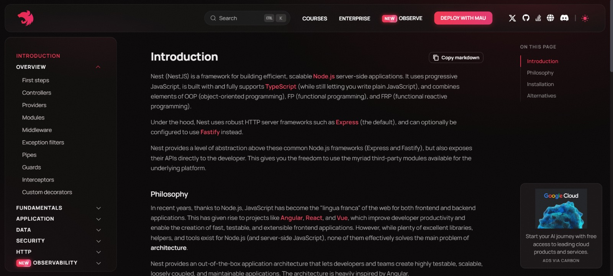

# What is NestJS?  

**Milestone:** 6  
**Issue Number:** #46  
**Date:** 27/09/2026

## NestJS Overview

NestJS is a Node.js framework used for building efficient, scalable, and maintainable server-side applications. It is built with and fully supports TypeScript, while also allowing JavaScript.

NestJS provides a structured application architecture instead of leaving the entire organization of the application to the developer. It is built on top of HTTP frameworks such as Express and can also use Fastify.

I referred to the official NestJS documentation to understand the framework and its main concepts.

## NestJS vs Express.js

Express.js is a minimal and flexible Node.js web framework. It provides the basic features needed to build web applications and APIs, mainly through routing and middleware.

NestJS provides a more structured architecture on top of Node.js HTTP frameworks. It introduces concepts such as modules, controllers, providers, dependency injection, and decorators.

| Aspect | NestJS | Express.js |
|---|---|---|
| Architecture | Structured and modular | Minimal and flexible |
| Language | TypeScript support is built in | JavaScript/TypeScript can be used |
| Organization | Uses modules, controllers, and providers | Developers decide how to organize the application |
| Dependency Injection | Built-in dependency injection system | No built-in DI system |
| Decorators | Uses decorators extensively | Does not use decorators as a core architectural feature |
| Routing | Uses controllers and decorators | Uses methods such as `app.get()` and `app.post()` |
| Middleware | Supported | Core part of the framework |

NestJS can use Express underneath by default, so it does not replace the underlying HTTP functionality. Instead, it provides a higher-level structure and architecture for building applications.

## NestJS Modular Architecture

NestJS applications are organized into modules. A module groups related parts of an application together and helps keep large applications organized.

The main concepts are:

### Modules

A module is a class decorated with `@Module()`. It can contain controllers and providers and can import or export other modules.

For example:

```typescript
@Module({
  controllers: [UsersController],
  providers: [UsersService],
})
export class UsersModule {}
```

A feature such as users, authentication, or products can have its own module. This makes it easier to separate different parts of a large application.

### Controllers

Controllers are responsible for handling incoming requests and sending responses.

A controller can define routes using decorators such as `@Get()` and `@Post()`.

Example:

```typescript
@Controller('users')
export class UsersController {
  @Get()
  findAll() {
    return 'All users';
  }
}
```

The `@Controller()` decorator tells NestJS that the class is a controller and can be associated with routes.

### Services / Providers

Services contain application logic that should be separated from the controller.

A service can be registered as a provider and then injected into a controller.

Example:

```typescript
@Injectable()
export class UsersService {
  findAll() {
    return ['User 1', 'User 2'];
  }
}
```

Keeping application logic in services prevents controllers from becoming unnecessarily large.

## Dependency Injection

Dependency Injection (DI) is a design pattern used by NestJS to provide a class with the dependencies it needs instead of making the class create those dependencies itself.

For example:

```typescript
@Injectable()
export class UsersService {
  findAll() {
    return ['User 1', 'User 2'];
  }
}
```

The service can then be injected into a controller through its constructor:

```typescript
@Controller('users')
export class UsersController {
  constructor(private readonly usersService: UsersService) {}

  @Get()
  findAll() {
    return this.usersService.findAll();
  }
}
```

Here, the controller does not create the `UsersService` itself. NestJS manages the provider and supplies it to the controller through dependency injection.

This helps reduce tight coupling and makes components easier to maintain and test.

## Decorators

NestJS makes extensive use of TypeScript decorators to provide metadata and describe how different classes should be handled by the framework.

### `@Module()`

`@Module()` defines a NestJS module and its components.

```typescript
@Module({
  controllers: [UsersController],
  providers: [UsersService],
})
export class UsersModule {}
```

### `@Controller()`

`@Controller()` identifies a class as a controller and can define a route prefix.

```typescript
@Controller('users')
export class UsersController {}
```

### `@Injectable()`

`@Injectable()` marks a class as a provider that can be managed by NestJS's dependency injection system.

```typescript
@Injectable()
export class UsersService {}
```

Decorators make the intended role of classes clear and allow NestJS to use the associated metadata when building the application.

## Benefits of Modular Architecture in Large Applications

A modular architecture is useful when an application becomes larger because it allows related functionality to be grouped together.

Some benefits include:

- **Separation of concerns:** Different parts of the application can have separate responsibilities.
- **Maintainability:** Changes to one feature can be made within its module without unnecessarily affecting unrelated features.
- **Reusability:** Providers can be shared between modules when required.
- **Scalability:** New features can be added as separate modules.
- **Testability:** Services and other providers can be isolated and tested more easily.
- **Team development:** Different developers can work on different application modules with clearer boundaries.

## Reflection

### Key differences between NestJS and Express.js

The main difference I understood is that Express.js provides a minimal and flexible foundation for building Node.js applications, while NestJS provides a more opinionated and structured architecture. NestJS includes concepts such as modules, controllers, providers, dependency injection, and decorators as part of its architecture.

### Why does NestJS use decorators?

Decorators allow NestJS to associate metadata with classes and their methods. This helps the framework understand whether a class is a module, controller, or injectable provider and how it should be handled.

### How does Dependency Injection work?

Dependency Injection allows NestJS to manage providers and supply them to classes that need them. Instead of a controller creating its own service, the required service can be provided through the constructor.

### Benefits of modular architecture

I understood that modular architecture becomes especially useful as applications grow. Grouping related functionality into modules makes the application easier to understand, maintain, test, and extend.

## Screenshot Evidence

### Official NestJS Documentation

The screenshot below shows the official NestJS documentation that was used as the primary reference for this research.

