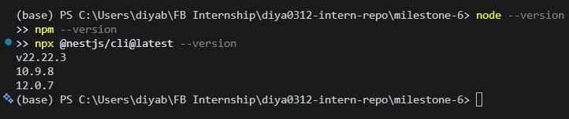
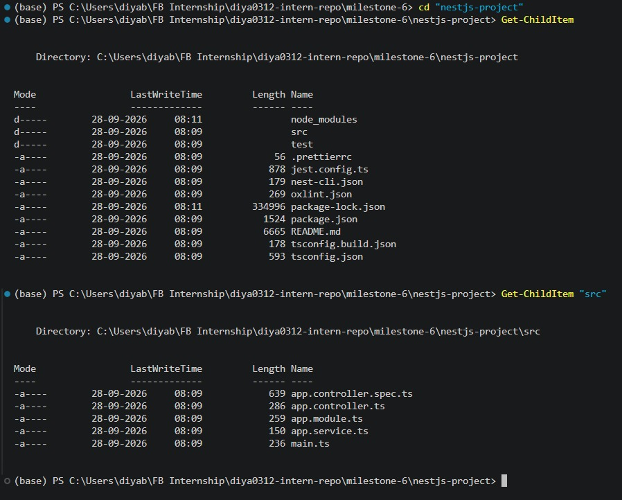
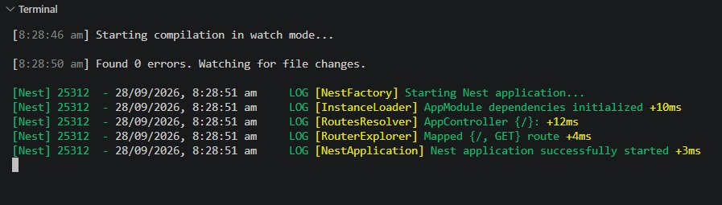
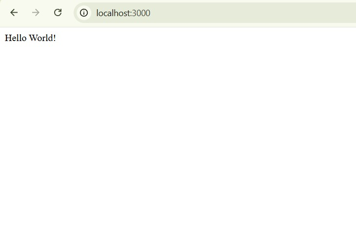

# NestJS Project Setup

**Milestone:** 6  
**Issue Number:** #45  
**Date:** 28/09/2026

## Project Setup

I set up a new NestJS project using the Nest CLI and npm. The project was created separately for this onboarding activity so that I could explore the default NestJS project structure without modifying the existing backend onboarding materials.

## Default Project Structure

The generated project contains a `src` directory with the main application files:

- `app.controller.ts` - Defines the application's basic HTTP route.
- `app.controller.spec.ts` - Contains the default controller test.
- `app.module.ts` - Defines the root `AppModule`.
- `app.service.ts` - Contains the service used by the controller.
- `main.ts` - The entry point that bootstraps the NestJS application.

## How `main.ts` Bootstraps the Application

`main.ts` is the entry point of the NestJS application. It uses `NestFactory.create()` to create the application instance using `AppModule`, and then starts the HTTP server by calling `app.listen()`.

This separates application startup from the rest of the application structure and provides a clear entry point for the backend.

## Role of `AppModule`

`AppModule` is the root module of the NestJS application. It provides the main organizational structure for the application and can contain controllers, providers, and other imported modules.

As an application grows, additional modules can be added and organized according to different features or areas of functionality.

## Running the Development Server

I ran the NestJS application using the development server command and verified that the application started successfully.

## Testing the Endpoint

I tested the default endpoint by opening `http://localhost:3000` in a browser. The application returned the default `Hello World!` response.

## How NestJS Structure Helps With Scalability

NestJS provides a modular structure that helps organize larger backend applications into separate modules, controllers, and services. This makes responsibilities easier to separate and allows features to be developed and maintained independently.

The dependency injection system also helps components receive the services they need without tightly coupling their implementations.

## Reflection

This activity helped me understand how a NestJS application is initialized and how its default files work together. I also learned how the controller, service, module, and application entry point fit into the overall backend structure. Setting up and running a basic project gave me a clearer understanding of the structure I would encounter when working on a larger NestJS backend.
