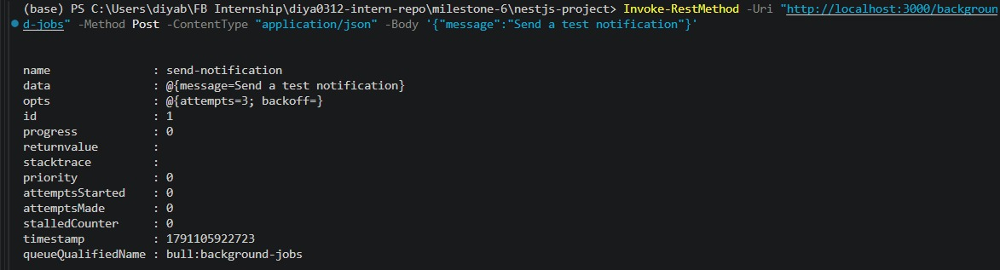
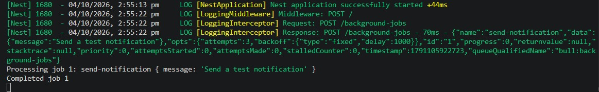
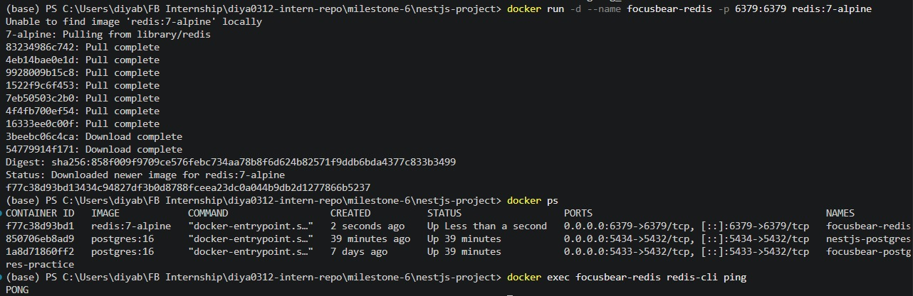
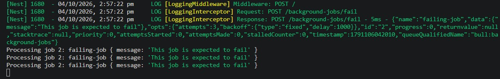

# NestJS BullMQ & Redis  

**Milestone:** 7    
**Issue Number:** #24    
**Date:** 28/09/2026  
## BullMQ

- BullMQ is a job queue system built on Redis.
- It allows time-consuming work to run outside the main API request.
- This helps keep API requests responsive.
- Jobs can be processed by separate workers.

## Queue Flow

```text
API request
    ↓
BullMQ Queue
    ↓
Redis
    ↓
BullMQ Worker
    ↓
Background task
```

## NestJS Setup

- Installed `@nestjs/bullmq` and `bullmq`.
- Configured the Redis connection using `BullModule.forRoot()`.
- Registered the `background-jobs` queue using `BullModule.registerQueue()`.
- Created a processor using `WorkerHost`.
- Injected the queue into a service using `@InjectQueue()`.

## Adding Jobs

- Added a `POST /background-jobs` endpoint.
- The endpoint places a `send-notification` job into the queue.
- The API receives a job ID without waiting for the background work to finish.



## Processing Jobs

- The `BackgroundJobProcessor` processes jobs from the queue.
- The processor simulates background work using an asynchronous delay.
- Successful jobs are moved to the completed state.



## Redis

- Redis acts as the backend for the BullMQ queue.
- Job information is persisted in Redis.
- This allows queued jobs to remain available when the application is restarted.
- Multiple producers and consumers can work with the same named queue.



## Failed Jobs and Retries

- If a processor throws an error, BullMQ marks the job as failed.
- Failed jobs can be automatically retried using the `attempts` option.
- Backoff settings can control the delay between retry attempts.
- The example job was configured with three attempts.



## Why Background Jobs?

- Long-running work can slow down API requests if handled directly.
- Background jobs allow the API to return quickly while processing continues separately.
- They are useful for:
  - Sending notifications
  - Processing analytics
  - Synchronizing data
  - Generating reports
  - Other time-consuming operations

## Reflection

- BullMQ separates background processing from normal API request handling.
- Redis provides persistent queue storage and allows producers and workers to communicate through the queue.
- Workers process jobs asynchronously and move successful jobs to completed state.
- Failed jobs can be retried using configured attempts and backoff settings.
- In a Focus Bear-style backend, BullMQ can be useful for tasks such as notifications, analytics processing, and synchronization that should not block the user-facing API.