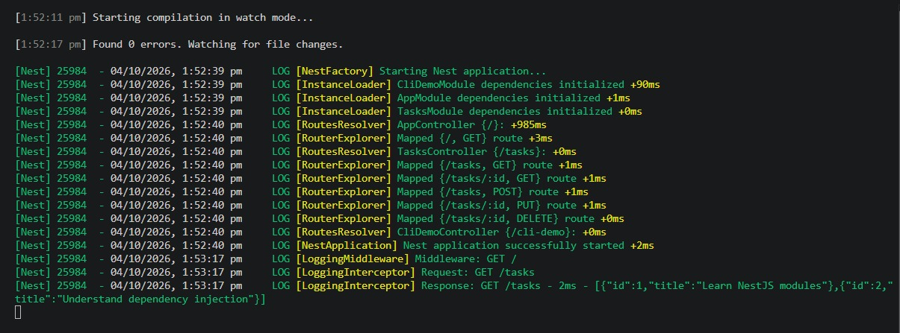
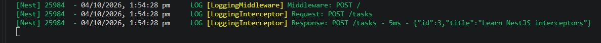
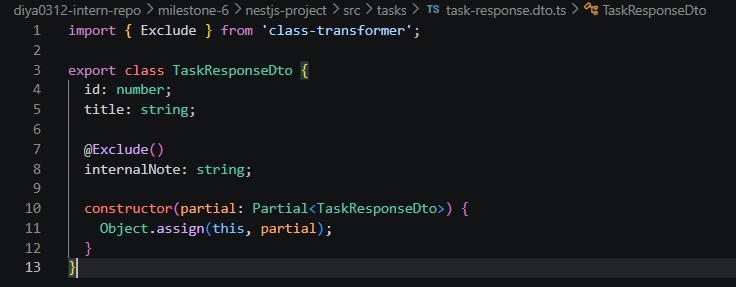

# NestJS Interceptors & Middleware  

**Milestone:** 7    
**Issue Number:** #39    
**Date:** 04/10/2026  

## Interceptors

- Interceptors run before and after a route handler.
- They can observe or transform request and response processing.
- They are useful for cross-cutting concerns such as:
  - Logging
  - Response transformation
  - Performance measurement
  - Error handling

## Middleware

- Middleware runs before the route handler.
- It has access to the request, response, and `next()` function.
- It is useful for:
  - Request preprocessing
  - Logging
  - Authentication checks
  - Adding data to requests

## Interceptor vs Middleware

- **Middleware**
  - Runs before the route handler.
  - Works directly with request and response objects.
  - Uses `next()` to continue processing.

- **Interceptor**
  - Wraps the route handler.
  - Can run logic before and after the handler.
  - Can observe or transform the returned response.

## When to Use an Interceptor

- Use an interceptor when logic needs to work around the execution of a route handler.
- Good examples include:
  - Logging request and response information.
  - Measuring execution time.
  - Transforming responses.
  - Handling cross-cutting concerns.

## ClassSerializerInterceptor

- `ClassSerializerInterceptor` uses `class-transformer`.
- It can transform returned class instances before they are sent to the client.
- Decorators such as `@Exclude()` can prevent sensitive properties from appearing in responses.
- This is useful for controlling which data is exposed by an API.

## LoggerErrorInterceptor

- `LoggerErrorInterceptor` is not a built-in NestJS interceptor.
- It is provided by logging libraries such as `nestjs-pino`.
- It captures exceptions and exposes additional error information for logging.
- This can help logging systems record useful error details such as the error class and stack trace.

## Reflection

- Middleware is useful for processing requests before they reach the route handler.
- Interceptors are useful when logic needs to run around the route handler and observe or transform the response.
- The logging interceptor demonstrated both request and response logging.
- The middleware demonstrated request preprocessing and logging.
- `ClassSerializerInterceptor` provides a centralized way to control response serialization.