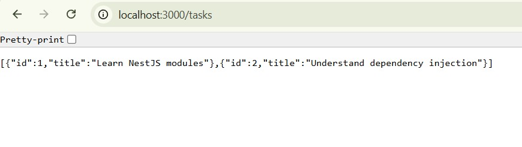
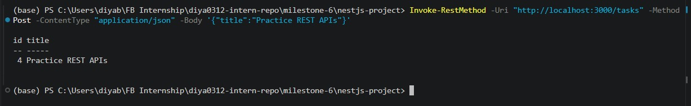
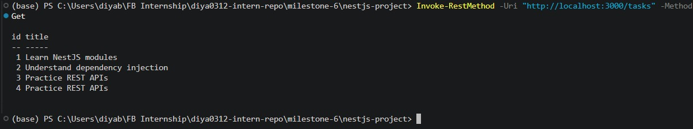
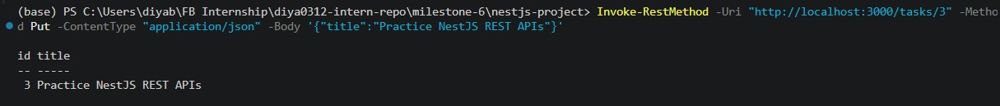
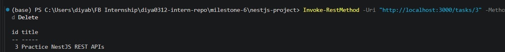

# Creating REST APIs with NestJS

**Milestone:** 7  
**Issue Number:** #41  
**Date:** 28/09/2026

## REST APIs in NestJS

NestJS supports RESTful API development through controllers, route decorators, services, and dependency injection.

For this task, a simple in-memory Tasks API was created. The controller exposes CRUD endpoints while the service contains the task-related business logic.

The API supports:

- `GET /tasks` - retrieve all tasks
- `GET /tasks/:id` - retrieve a specific task
- `POST /tasks` - create a new task
- `PUT /tasks/:id` - update an existing task
- `DELETE /tasks/:id` - delete a task

## Controller

A controller is responsible for handling incoming HTTP requests and returning responses.

The `TasksController` uses the `@Controller('tasks')` decorator to define the base route for the task endpoints.

HTTP method decorators are then used to map requests to specific handler methods.

The controller delegates the actual task operations to `TasksService` instead of containing the business logic itself.

## HTTP Method Mapping

NestJS provides decorators that map controller methods to HTTP methods.

The following decorators were used:

    @Get()

    @Post()

    @Put()

    @Delete()

For example, `@Get()` maps a handler to a GET request, while `@Post()` maps a handler to a POST request.

The route parameters and request body are accessed using decorators such as `@Param()` and `@Body()`.

## Service and Business Logic

The `TasksService` contains the operations used by the API.

The service provides methods for:

- Retrieving all tasks
- Retrieving an individual task
- Creating a task
- Updating a task
- Deleting a task

Keeping these operations in the service separates business logic from HTTP request handling.

The controller is therefore responsible for receiving requests and passing the required information to the service.

## CRUD Endpoints

### GET `/tasks`

The GET endpoint retrieves all tasks from the service.

### POST `/tasks`

The POST endpoint creates a new task.

A JSON request body containing a task title was sent to the API.

The newly created task was then visible when the GET endpoint was called again.

### PUT `/tasks/:id`

The PUT endpoint updates an existing task based on its ID.

### DELETE `/tasks/:id`

The DELETE endpoint removes a task based on its ID.

## Separation of Responsibilities

Separating business logic from controllers makes the application easier to maintain.

The controller focuses on HTTP-related responsibilities such as receiving requests, reading route parameters, and passing data to the service.

The service handles the task operations themselves.

This separation means that changes to the task logic can be made in the service without putting unrelated logic into the controller.

## Why Services Are Useful

Services allow business logic to be reused by different parts of an application.

They also make controllers smaller and easier to understand.

Using services together with dependency injection allows NestJS to manage dependencies automatically. In this project, `TasksService` is injected into `TasksController` through the constructor.

## How NestJS Maps HTTP Methods

NestJS uses decorators to map methods to HTTP requests.

The `@Get()`, `@Post()`, `@Put()`, and `@Delete()` decorators tell NestJS which HTTP method should invoke a particular handler.

For example:

    @Get()
    getTasks() {
      return this.tasksService.getTasks();
    }

When a GET request is sent to `/tasks`, NestJS routes the request to the `getTasks()` handler.

Similarly, the other decorators map POST, PUT, and DELETE requests to their corresponding handlers.

## Testing the API

The REST endpoints were tested using PowerShell `Invoke-RestMethod`.

Examples of the requests used were:

    Invoke-RestMethod -Uri "http://localhost:3000/tasks" -Method Get

    Invoke-RestMethod -Uri "http://localhost:3000/tasks" -Method Post -ContentType "application/json" -Body '{"title":"Practice REST APIs"}'

    Invoke-RestMethod -Uri "http://localhost:3000/tasks/3" -Method Put -ContentType "application/json" -Body '{"title":"Practice NestJS REST APIs"}'

    Invoke-RestMethod -Uri "http://localhost:3000/tasks/3" -Method Delete

The API successfully handled the CRUD operations.

## Reflection

A controller in NestJS handles incoming HTTP requests and maps them to application operations. It should focus on request and response handling rather than containing large amounts of business logic.

Business logic should be placed in services because this keeps responsibilities separated and makes the application easier to maintain and test.

Using services also works naturally with NestJS dependency injection. The controller can depend on a service without creating the service manually.

NestJS automatically maps HTTP methods to handlers using decorators such as `@Get()`, `@Post()`, `@Put()`, and `@Delete()`. This makes REST endpoint definitions clear and consistent.

The Tasks API demonstrated how controllers, services, dependency injection, and HTTP method decorators work together to create a simple RESTful API.