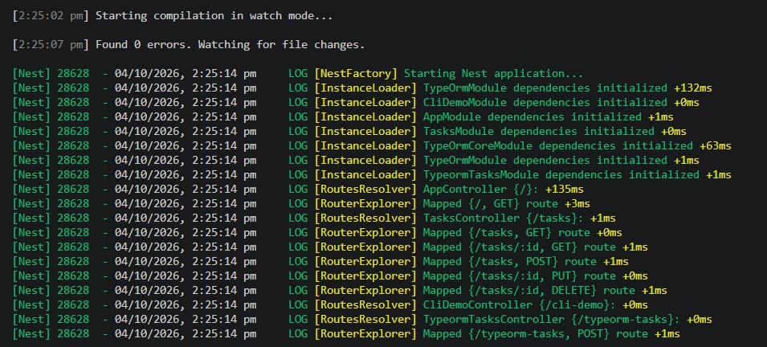
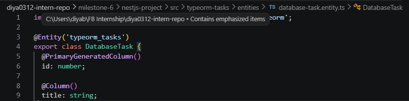
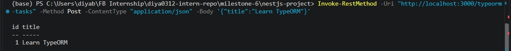
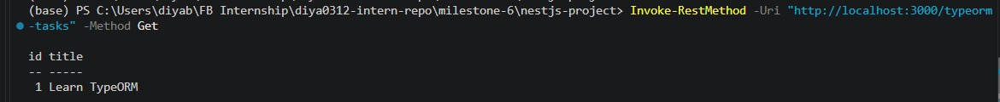
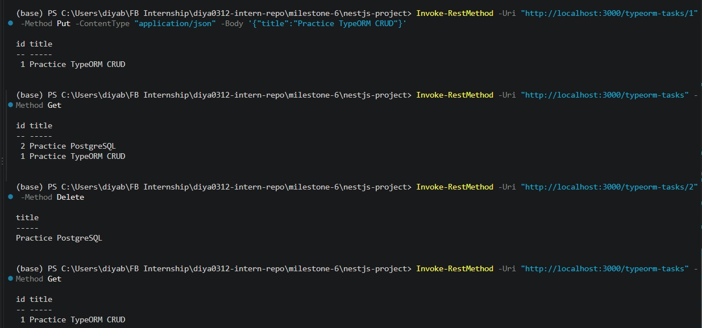

# NestJS TypeORM & PostgreSQL  

**Milestone:** 7        
**Issue Number:** #38        
**Date:** 04/10/2026  

## TypeORM Integration

- `@nestjs/typeorm` provides NestJS-specific integration with TypeORM.
- `TypeOrmModule.forRoot()` establishes the database connection.
- `TypeOrmModule.forFeature()` registers repositories for a module.
- `@InjectRepository()` allows a repository to be injected into a service.

## Entity

- An entity represents a database table using a TypeScript class.
- Decorators such as `@Entity()`, `@Column()`, and `@PrimaryGeneratedColumn()` define the table structure.
- The `DatabaseTask` entity represents the `typeorm_tasks` table.

## Repository

- A repository provides methods for working with a specific entity.
- The repository was injected using `@InjectRepository(DatabaseTask)`.
- Used repository methods such as:
  - `create()`
  - `save()`
  - `find()`
  - `findOneBy()`
  - `remove()`

## CRUD Operations

- **Create:** Added tasks using a POST request.
- **Read:** Retrieved tasks using GET requests.
- **Update:** Updated task titles using PUT requests.
- **Delete:** Removed tasks using DELETE requests.

## Migrations

- TypeORM migrations manage database schema changes.
- Migrations are separate from normal CRUD operations.
- The migration CLI can generate, apply, and revert schema changes.
- The NestJS database connection uses `synchronize: false` so schema changes can be managed through migrations.

## PostgreSQL

- PostgreSQL is a relational database with strong support for structured data.
- It supports transactions, constraints, indexes, and relationships.
- It works well with TypeORM and NestJS for applications that need relational data.

## Reflection

- `@nestjs/typeorm` makes TypeORM easier to use inside NestJS by providing database connection configuration and repository injection.
- An entity describes the structure of database data, while a repository provides methods to access and modify that data.
- Migrations provide a version-controlled way to change the database schema.
- PostgreSQL is a strong choice for applications that need reliable relational data and transactions.