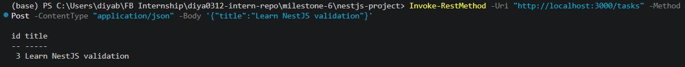
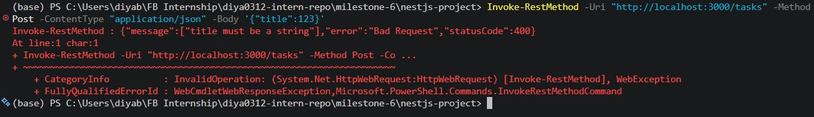
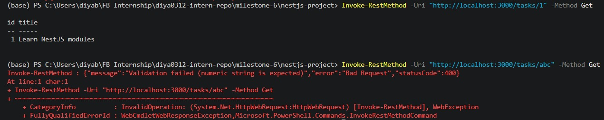

# NestJS Request Validation  

**Milestone:** 7    
**Issue Number:** #40    
**Date:** 29/09/2026   

## What Are Pipes?

- Pipes process incoming request data before it reaches the controller.
- They can validate data.
- They can also transform data.
- NestJS provides built-in pipes such as `ValidationPipe` and `ParseIntPipe`.

## ValidationPipe

- `ValidationPipe` validates incoming request data against DTO rules.
- It helps prevent invalid data from reaching the application logic.
- A global validation pipe applies validation across the application.
- `transform: true` enables transformation support for incoming data.

## Built-in and Custom Pipes

- **Built-in pipes:** Provided by NestJS and ready to use.
  - `ValidationPipe`
  - `ParseIntPipe`
- **Custom pipes:** Created when application-specific validation or transformation is required.

## DTOs and Decorators

- DTOs define the expected structure of incoming data.
- `class-validator` decorators define validation rules.
- `@IsString()` checks that a value is a string.
- `@IsNotEmpty()` checks that a value is not empty.
- Validation decorators work with `ValidationPipe` to validate DTOs.

## ParseIntPipe

- Route parameters are received as strings by default.
- `ParseIntPipe` converts a route parameter into an integer.
- It rejects values that cannot be parsed as integers.

## Reflection

- Pipes provide a reusable way to validate and transform incoming requests.
- DTO validation helps maintain consistent data structures.
- Rejecting invalid input before it reaches the service improves data integrity.
- Using built-in pipes such as `ValidationPipe` and `ParseIntPipe` keeps request handling clear and structured.