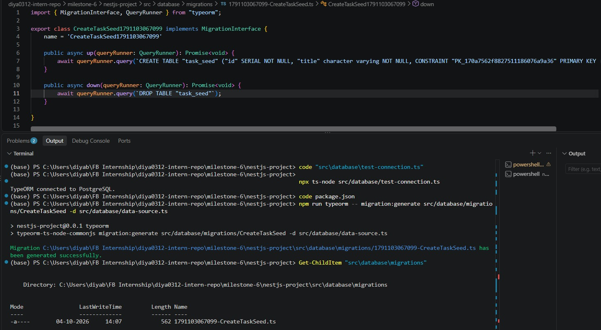
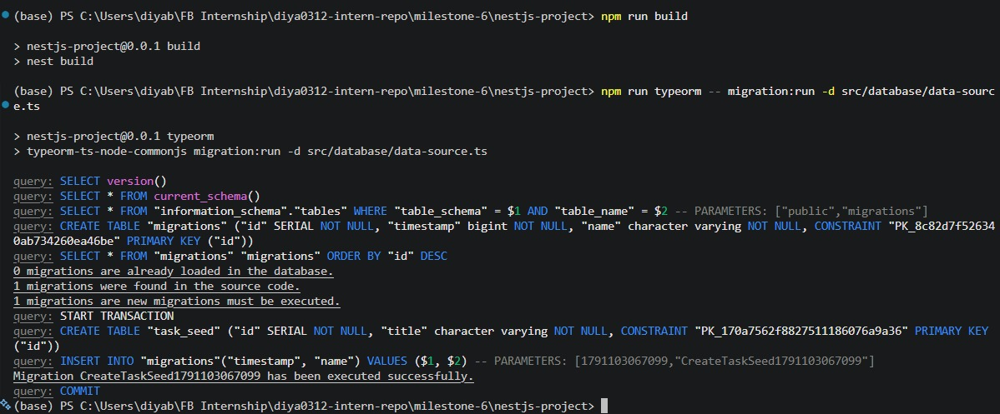
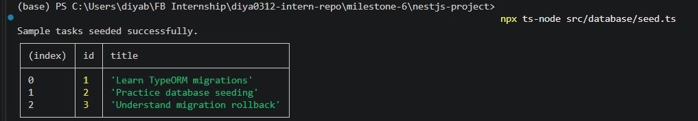
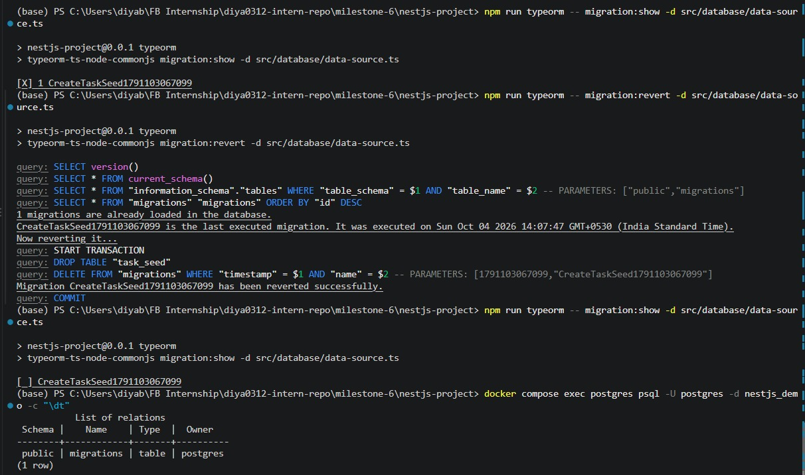

# TypeORM Migrations & Seeding  

**Milestone:** 7      
**Issue Number:** #37      
**Date:** 04/10/2026    

## Database Migrations

- Migrations are version-controlled changes to the database schema.
- TypeORM can generate migrations by comparing entities with the current database schema.
- Migrations contain `up()` and `down()` methods.
- `up()` applies the schema change.
- `down()` reverses the schema change.

## Applying Migrations

- Used `migration:generate` to create a migration from the `TaskSeed` entity.
- Used `migration:run` to apply the migration to PostgreSQL.
- The migration created the `task_seed` table.
- `synchronize` was disabled so schema changes are controlled through migrations.

## Seeding

- Seeding adds initial or sample data to a database.
- Created a seed script using a TypeORM repository.
- Used `getRepository(TaskSeed)` to access the entity repository.
- Used `repository.save()` to insert sample tasks.
- Used `repository.find()` to verify the inserted data.

## Migrations vs Seeding

- **Migrations:** Manage database schema changes.
- **Seeding:** Adds initial or sample records.
- Migrations answer how the database structure changes.
- Seeding answers what initial data should be present.

## Version Control

- Database schema changes should be version-controlled along with application code.
- This makes changes reproducible across development, testing, and production environments.
- Migration history also makes it easier to understand which schema changes have been applied.

## Rollbacks

- TypeORM migrations include a `down()` method for reversing changes.
- `migration:revert` runs the `down()` method of the latest executed migration.
- Rollbacks are useful when a migration introduces an unexpected problem.

## Reflection

- TypeORM migrations provide a structured way to manage database schema changes.
- Seeding is different from migration because it focuses on inserting data rather than changing the schema.
- Version-controlled migrations make database changes repeatable and easier to track.
- Testing `migration:revert` showed how a migration can be rolled back and then applied again.