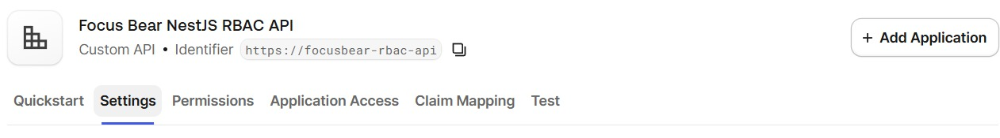
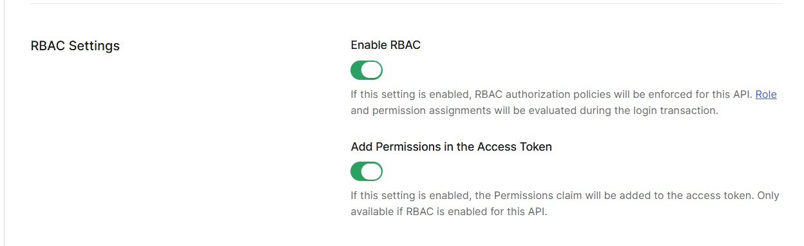
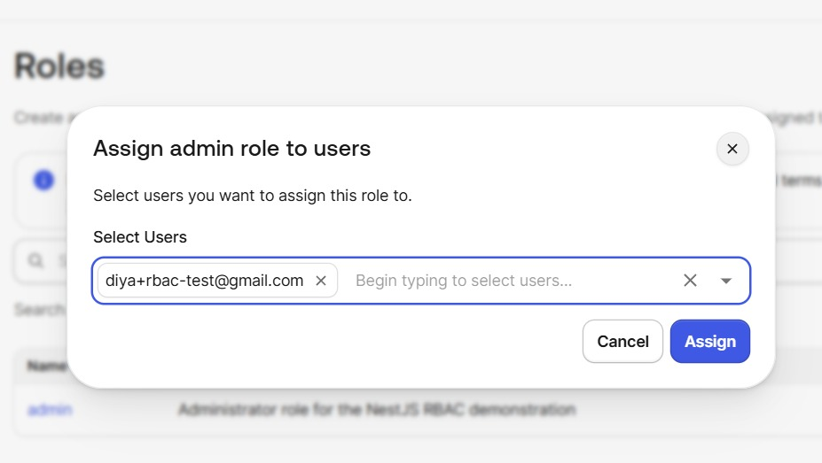
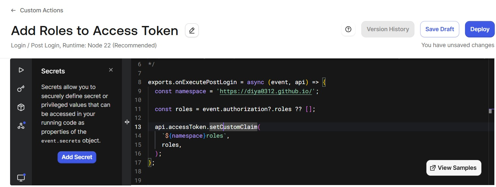
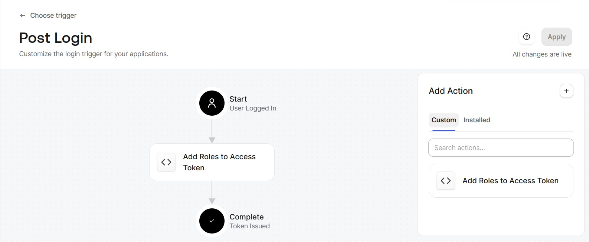
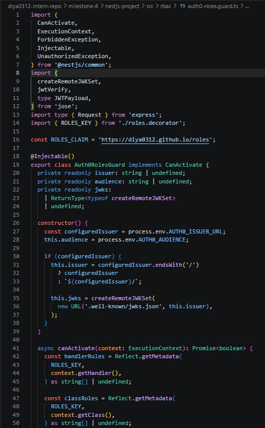
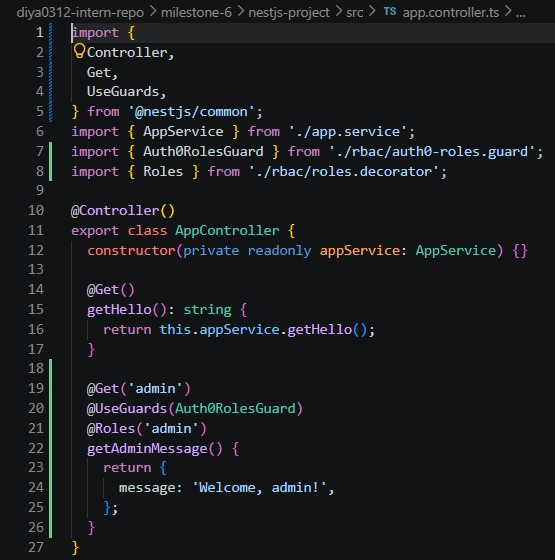
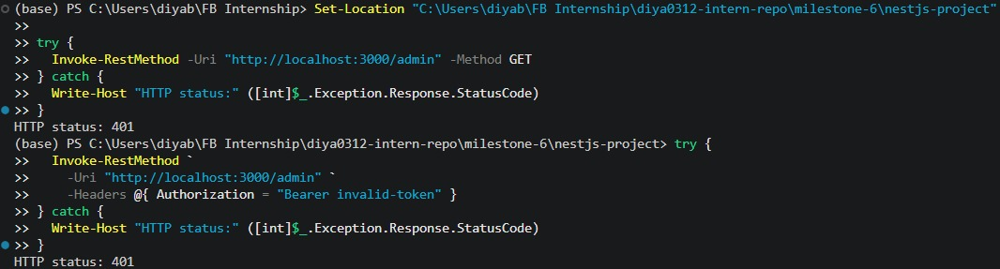

# NestJS Role-Based Authorization (RBAC)

**Milestone:** 8    
**Issue Number:** #30    
**Date:** 11/10/2026    

## Objective

- Implemented Role-Based Access Control (RBAC) in a NestJS application using Auth0.
- Protected the admin endpoint so that access requires a valid access token and the appropriate role.

## Auth0 Configuration

- Created a custom Auth0 API named **Focus Bear NestJS RBAC API**.
- Configured the API audience as `https://focusbear-rbac-api`.
- Created the `admin` role and assigned it to a test user.
- Created a Post-Login Action to add assigned roles to a custom access-token claim.
- Attached the Action to the Auth0 Post-Login flow.

## NestJS Implementation

- Implemented a `Roles` decorator to specify the roles required by an endpoint.
- Implemented an `Auth0RolesGuard` to validate access tokens using Auth0's JWKS, verify the issuer and audience, and check the required role.
- Protected the `/admin` endpoint using the guard and `@Roles('admin')`.

## Testing and Results

The `/admin` endpoint was tested using PowerShell.

- Request without an access token returned `401 Unauthorized`.
- Request with an invalid token returned `401 Unauthorized`.
- Request with a valid Client Credentials token without the required `admin` role returned `403 Forbidden`.
- Successful access using a token containing the required `admin` role has not yet been verified.

## Reflection

- Auth0 can manage roles and include role information in access tokens using a Post-Login Action.
- The NestJS guard verifies the access token before checking the required role.
- The tests demonstrated the difference between `401 Unauthorized` and `403 Forbidden`.
- The Client Credentials token represented an application and did not contain the required `admin` role claim.
- A successful request using a token containing the assigned `admin` role still needs to be verified.
